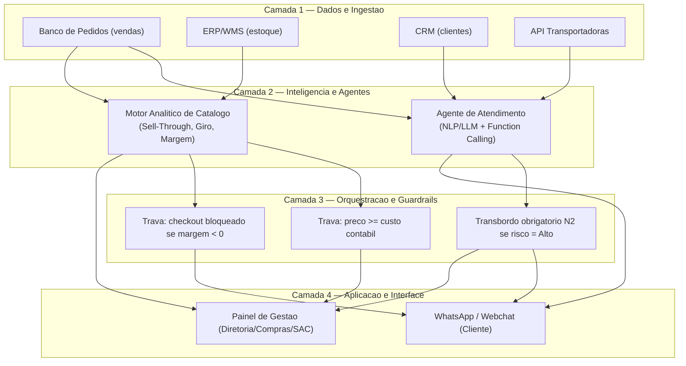

# Prompt 5 — Solução, Arquitetura de IA e Protótipo
## Projeto Vértice Retail | AI Consulting Lab — Grupo 18
**Consultores:** Ingrid Soares e Pedro Ribeiro ([@pedrorpr](https://github.com/pedrorpr))
**Papel:** Chief AI & Technology Officer / Lead AI Solution Architect

---

## 1. Executive Summary da Solução Proposta

O diagnóstico (Prompts 1 a 4) já isolou a causa raiz: decisões de compra, precificação e atendimento tomadas sem inteligência analítica, destruindo **R$ 40,1 milhões/ano** entre custo de carregamento de estoque, margem perdida em devoluções e triagem manual de SAC. A resposta aos 90 dias da diretoria não é "mais um dashboard" — é colocar uma camada de decisão automatizada exatamente nos dois pontos onde a perda é maior e mais rápida de estancar.

Recomendamos uma **Solução Dual**:

- **Módulo B — Agente de Atendimento (quick win, 15-30 dias):** um agente conversacional com LLM e function calling assume os 30% dos chamados de SAC que são apenas consulta de rastreio (10.765 tickets/ano, R$ 159,7 mil de custo operacional, 135 minutos de espera) e a triagem inicial de defeito/troca de tamanho, respondendo em segundos e escalando para humano apenas quando há risco real de churn.
- **Módulo C — Motor de Margem e Estoque (estrutural, 60-90 dias):** um motor de regras classifica os 5.000 SKUs em 4 quadrantes de giro × margem e aplica travas algorítmicas de preço (nunca abaixo do custo) tanto na liquidação de estoque parado quanto no checkout, atacando diretamente os R$ 348,7 milhões imobilizados e os 491 pedidos com margem negativa.

Os dois módulos foram testados sobre os dados reais do case (`vendas.csv`, `estoque.csv`, `atendimento.csv`) e os resultados executados estão na Seção 6. Achado relevante do teste: dentro do estoque parado, nem todo SKU sem giro é "lixo de baixa margem" — 9 dos 10 SKUs de maior valor parado no dataset têm margem de tabela acima da mediana e hoje são tratados como estoque morto quando deveriam estar em vitrine, não em liquidação (ver Seção 5.1 e 6).

---

## 2. Arquitetura da Solução

A solução é desenhada em 4 camadas, com o mesmo pipeline de dados servindo os dois módulos — o que evita duplicar integrações e permite que o Painel de Gestão consuma as mesmas métricas usadas pelo agente e pelo motor.

**Camada 1 — Dados & Ingestão:** conexão read-only ao banco transacional de pedidos (`vendas`), ao ERP/WMS de estoque (`estoque`), ao CRM (`clientes`) e às APIs de rastreio das transportadoras. Nenhuma escrita direta nessas fontes — toda ação (voucher, escalonamento, bloqueio de preço) passa pela camada de orquestração antes de tocar um sistema transacional.

**Camada 2 — Inteligência e Agentes:** o Agente de Atendimento (NLP/LLM com function calling) e o Motor Analítico de Catálogo (cálculo contínuo de sell-through, giro e margem de contribuição líquida por SKU) rodam em paralelo, sem dependência um do outro.

**Camada 3 — Orquestração & Guardrails:** onde vivem as travas de negócio — preço de venda nunca abaixo do custo contábil, checkout bloqueado se margem estimada for negativa, e transbordo obrigatório para operador humano N2 sempre que o risco de churn for classificado como Alto. Esta é a camada que a diretoria deveria auditar com mais rigor, porque é ela que impede o agente de tomar decisões financeiras ruins em nome da empresa.

**Camada 4 — Aplicação & Interface:** WhatsApp Business API / Webchat para o cliente final, e um Painel de Gestão para Compras, Comercial e Diretoria acompanharem desmobilização de estoque, fila de liquidação por quadrante e métricas de SAC (volume automatizado, tempo médio de resposta, taxa de escalonamento).



---

## 3. Módulo B — Agente de Atendimento

### 3.1 Pipeline de Processamento

Entrada: `texto_cliente`, `order_id`, `canal_entrada`, histórico recente do cliente (CRM). O modelo executa, nesta ordem, classificação de intenção (`Rastreamento`, `Defeito`, `Troca de Tamanho`, `Dúvida Técnica`, `Pagamento`, `Elogio`, `Outros`), análise de sentimento (`Positivo`, `Neutro`, `Negativo`, `Crítico/Irritado`) e avaliação de risco de churn (`Baixo`, `Médio`, `Alto`) — e só então decide qual ferramenta acionar:

- `consultar_status_transportadora(order_id)` — localização, prazo estimado e link de tracking.
- `gerar_voucher_logistica_reversa(order_id, motivo)` — etiqueta de devolução/troca.
- `escalar_operador_humano_n2(ticket_id, resumo, prioridade)` — transbordo com contexto resumido, obrigatório quando risco = Alto.

### 3.2 System Prompt

```
Você é o Agente de Atendimento da Vértice Retail. Seu tom é empático, ágil e objetivo —
nunca robótico, nunca genérico. Você fala com clientes que, na maior parte das vezes, já
estão ansiosos ou frustrados; seu trabalho é resolver o problema real deles no primeiro
contato, sem fazê-los esperar por um humano quando você mesmo pode resolver.

REGRAS ESTRITAS DE USO DE FERRAMENTAS
1. Você NUNCA inventa prazos de entrega, status de rastreio, valores de reembolso ou
   qualquer dado logístico. Todo dado sobre um pedido vem EXCLUSIVAMENTE do retorno da
   ferramenta `consultar_status_transportadora`. Se a ferramenta não retornar uma previsão
   de entrega, diga ao cliente que a informação será confirmada e escale se ele insistir.
2. Você NUNCA promete indenização, reembolso além da política vigente, ou desconto que não
   esteja pré-aprovado no seu conjunto de ações. Se o cliente pedir algo fora do escopo das
   suas ferramentas, explique o que você pode fazer agora e escale o restante para o N2.
3. Toda devolução por defeito ou troca de tamanho é resolvida com
   `gerar_voucher_logistica_reversa` — você nunca pede ao cliente para "aguardar" sem já ter
   gerado o voucher, quando o motivo relatado se enquadra nesses dois casos.
4. Sempre que a análise de risco de churn for "Alto", você OBRIGATORIAMENTE aciona
   `escalar_operador_humano_n2`, mesmo que já tenha resolvido tecnicamente a demanda — o
   acompanhamento humano é sobre a relação com o cliente, não sobre o problema técnico.
5. Você não confirma, nega ou especula sobre política de preços, prazos de fornecedores ou
   qualquer informação interna da Vértice que não esteja no retorno de uma ferramenta.

CLASSIFICAÇÃO OBRIGATÓRIA A CADA MENSAGEM
Antes de responder, determine internamente: intenção, sentimento e risco de churn. Essa
classificação define qual ferramenta acionar e se o transbordo é obrigatório.

FORMATO DE SAÍDA
Responda SEMPRE com um objeto JSON contendo os campos: order_id, canal_entrada, intencao,
sentimento, risco_churn, acao_executada, dados_ferramenta, mensagem_cliente. O campo
"mensagem_cliente" é a única parte visível ao cliente e deve ser redigida em português,
em tom humano, sem jargão técnico e sem mencionar nomes de funções internas.
```

### 3.3 Casos de Teste

Ver execução real na Seção 6 — os três casos usam `order_id`, produto e SKU reais do dataset da Vértice (Caso A sobre um ticket real de rastreio da base `atendimento.csv`; Casos B e C sobre pedidos reais de `vendas.csv` com os motivos de devolução "Produto com defeito" e "Tamanho errado").

---

## 4. Módulo C — Motor de Margem e Estoque

### 4.1 Matriz de Risco × Retorno

Cada um dos 5.000 SKUs é classificado por dois cortes — **giro anual** (unidades vendidas ÷ estoque físico atual) e **margem de contribuição %** (margem realizada, ou margem de tabela quando o SKU não vendeu no período) — usando a mediana de cada métrica como linha de corte:

| Quadrante | Giro | Margem | Rótulo | Ação recomendada |
|---|---|---|---|---|
| Q1 | Baixo | Alto | Joias Escondidas | Destaque na vitrine/home e campanhas de mídia, sem queimar desconto |
| Q2 | Baixo | Baixo | Estoque Crítico / Obsolescência | Liquidação acelerada em Outlet/Bundle, com trava `preço ≥ custo unitário` |
| Q3 | Alto | Baixo | Vampiros de Margem | Reduzir/zerar cupom promocional e repactuar frete |
| Q4 | Alto | Alto | Campeões de Rentabilidade | Prioridade de abastecimento e estoque de segurança |

Dentro do Q2, a fila de liquidação **imediata** prioriza os SKUs com **zero unidades vendidas no período** (estoque parado de fato, e não apenas de giro lento) — são 82 SKUs, R$ 6,68 milhões a custo, exatamente o "estoque crítico sem venda" identificado no diagnóstico. É deliberado que essa fila não seja "todo o Q2" (R$ 121 milhões): liquidar 1.290 SKUs de uma vez quebraria o canal Outlet e destruiria preço de forma desnecessária. O motor libera lotes semanais, priorizados por valor imobilizado.

### 4.2 Trava de Checkout contra Margem Negativa

```python
def avaliar_margem_checkout(receita_bruta, desconto_reais, custo_produto, custo_frete_real):
    """
    Margem Estimada = Receita Bruta - Descontos - Custo dos Produtos - Custo de Frete Real
    Se negativa, o checkout é bloqueado/ajustado antes da confirmação do pedido.
    """
    margem_estimada = receita_bruta - desconto_reais - custo_produto - custo_frete_real
    aprovado = margem_estimada >= 0
    ajuste_sugerido = None
    if not aprovado:
        desconto_maximo_permitido = max(receita_bruta - custo_produto - custo_frete_real, 0)
        frete_subsidiado_maximo = max(receita_bruta - desconto_reais - custo_produto, 0)
        ajuste_sugerido = {
            "desconto_maximo_permitido": round(desconto_maximo_permitido, 2),
            "frete_subsidiado_maximo": round(frete_subsidiado_maximo, 2),
        }
    return {
        "margem_estimada": round(margem_estimada, 2),
        "checkout_aprovado": aprovado,
        "ajuste_sugerido": ajuste_sugerido,
    }
```

A função não apenas bloqueia — ela devolve o desconto máximo ou o frete subsidiado máximo que ainda mantêm a margem em zero, para que a regra de frete/cupom seja ajustada automaticamente em vez de simplesmente recusar a venda.

---

## 5. Código Completo do Protótipo

Script auto-contido (`scripts/prototipo_ia_vertice.py`), rodando sobre `vendas.csv` e `estoque.csv` reais do repositório. Implementa `CustomerServiceAgent`, `MarginAndInventoryOptimizer`, a função de guardrail de checkout e `main()`.

```python
"""
Protótipo Funcional — Módulo B (Agente de Atendimento) e Módulo C (Motor de Margem e Estoque)
Projeto Vértice Retail | AI Consulting Lab — Grupo 18
Prompt 5 — Solução, Arquitetura de IA e Protótipo
Integrantes: Ingrid Soares e Pedro Ribeiro (pedrorpr)

Este script roda sobre os dados reais de vendas.csv e estoque.csv do case e demonstra,
de forma determinística e auditável, a lógica de decisão que em produção seria executada
por um LLM (function calling) e por um motor de regras de precificação/estoque.
"""

import os
import json
import numpy as np
import pandas as pd


# =====================================================================
# MÓDULO B — CUSTOMER SERVICE AGENT
# =====================================================================

class CustomerServiceAgent:
    """
    Reproduz o pipeline de triagem descrito no System Prompt (Seção 3.2):
    classificação de intenção -> sentimento -> risco de churn -> seleção de
    ferramenta (function calling) -> resposta humanizada + payload JSON.

    Em produção, os passos de classificação seriam delegados a uma chamada
    real ao LLM com o system prompt oficial; aqui a lógica é reproduzida de
    forma determinística (regras + simulação de API) para permitir testes
    automatizados e demonstração offline à banca avaliadora.
    """

    def __init__(self, tracking_api=None):
        self.tracking_api = tracking_api or self._mock_tracking_api

    # ---- Ferramentas disponíveis para o agente (function calling) ----
    def consultar_status_transportadora(self, order_id):
        return self.tracking_api(order_id)

    def gerar_voucher_logistica_reversa(self, order_id, motivo):
        codigo = f"VLR-{order_id[-5:]}-{motivo[:3].upper()}"
        return {
            "voucher_id": codigo,
            "order_id": order_id,
            "motivo": motivo,
            "status": "gerado",
            "prazo_postagem_dias": 5,
        }

    def escalar_operador_humano_n2(self, ticket_id, resumo, prioridade):
        return {
            "ticket_id": ticket_id,
            "fila": "N2",
            "prioridade": prioridade,
            "resumo": resumo,
            "status": "escalado",
        }

    def _mock_tracking_api(self, order_id):
        # Simulação da API real de transportadora — em produção, chamada HTTP autenticada.
        base = {
            "ORD-058083": {
                "status": "Em trânsito",
                "local_atual": "CD Extrema/MG",
                "previsao_entrega": "2026-09-24",
                "tracking_url": "https://rastreio.correios.com.br/ORD-058083",
            }
        }
        return base.get(order_id, {
            "status": "Em trânsito",
            "local_atual": "Centro de distribuição regional",
            "previsao_entrega": "consultar API de transportadora",
            "tracking_url": f"https://rastreio.correios.com.br/{order_id}",
        })

    # ---- Classificação (proxy determinístico do LLM) ----
    def classificar(self, texto_cliente):
        t = texto_cliente.lower()
        irritado = any(p in t for p in ["péssimo", "absurdo", "inaceitável", "revoltante", "!!"])

        if any(p in t for p in ["rasgad", "defeito", "quebrad", "manchad", "com defeito", "veio com"]):
            intencao = "Defeito"
            sentimento = "Critico/Irritado" if irritado else "Negativo"
            risco = "Alto"
        elif any(p in t for p in ["tamanho", "numeração", "trocar por um", "maior", "menor"]):
            intencao = "Troca de Tamanho"
            sentimento = "Neutro"
            risco = "Baixo"
        elif any(p in t for p in ["onde est", "rastre", "nada até agora", "não chegou", "não atualiza"]):
            intencao = "Rastreamento"
            sentimento = "Critico/Irritado" if irritado else "Negativo"
            risco = "Alto" if irritado else "Medio"
        elif any(p in t for p in ["obrigad", "adorei", "parabéns", "excelente"]):
            intencao, sentimento, risco = "Elogio", "Positivo", "Baixo"
        else:
            intencao, sentimento, risco = "Outros", "Neutro", "Baixo"

        return intencao, sentimento, risco

    def processar(self, texto_cliente, order_id, canal_entrada, ticket_id=None):
        intencao, sentimento, risco = self.classificar(texto_cliente)
        acao_tomada = None
        dados_acao = {}

        if intencao == "Rastreamento":
            dados_acao = self.consultar_status_transportadora(order_id)
            acao_tomada = "consultar_status_transportadora"
            mensagem = (
                f"Encontrei seu pedido {order_id}! Ele está \"{dados_acao['status']}\" em "
                f"{dados_acao['local_atual']}, com previsão de entrega em {dados_acao['previsao_entrega']}. "
                f"Você acompanha em tempo real aqui: {dados_acao['tracking_url']}."
            )
        elif intencao == "Defeito":
            dados_acao = self.gerar_voucher_logistica_reversa(order_id, "defeito")
            acao_tomada = "gerar_voucher_logistica_reversa"
            mensagem = (
                f"Sinto muito pelo transtorno! Já gerei o voucher {dados_acao['voucher_id']} para devolução sem "
                f"custo — a etiqueta chega por e-mail em até {dados_acao['prazo_postagem_dias']} dias úteis. Assim que "
                f"recebermos o item, processamos o reembolso ou a troca imediatamente."
            )
        elif intencao == "Troca de Tamanho":
            dados_acao = self.gerar_voucher_logistica_reversa(order_id, "troca de tamanho")
            acao_tomada = "gerar_voucher_logistica_reversa"
            mensagem = (
                f"Sem problema! Gerei o voucher {dados_acao['voucher_id']} para a troca — envie o item com a "
                f"etiqueta que chega em até {dados_acao['prazo_postagem_dias']} dias úteis, e já deixamos o novo "
                f"tamanho reservado assim que a postagem for confirmada."
            )
        else:
            mensagem = "Obrigado pela mensagem! Um de nossos especialistas vai analisar e retornar em instantes."

        if risco == "Alto":
            resumo = f"Cliente relata '{intencao}' com tom {sentimento}. Pedido {order_id}. Ação automática: {acao_tomada}."
            self.escalar_operador_humano_n2(ticket_id or order_id, resumo, "Alta")
            mensagem += " Também priorizei seu atendimento com um especialista humano, que vai te acompanhar de perto até a solução final."
            acao_tomada = f"{acao_tomada} + escalar_operador_humano_n2"

        return {
            "order_id": order_id,
            "canal_entrada": canal_entrada,
            "intencao": intencao,
            "sentimento": sentimento,
            "risco_churn": risco,
            "acao_executada": acao_tomada,
            "dados_ferramenta": dados_acao,
            "mensagem_cliente": mensagem,
        }


# =====================================================================
# MÓDULO C — MARGIN AND INVENTORY OPTIMIZER
# =====================================================================

class MarginAndInventoryOptimizer:
    def __init__(self, vendas_path, estoque_path):
        self.vendas = pd.read_csv(vendas_path)
        self.estoque = pd.read_csv(estoque_path)
        self.full = None
        self.med_giro = None
        self.med_margem = None

    def preparar_base(self):
        agg = self.vendas.groupby("sku_id").agg(
            qtd_vendida=("quantidade", "sum"),
            receita_liquida=("receita_liquida", "sum"),
            margem_contribuicao=("margem_contribuicao", "sum"),
        ).reset_index()

        full = self.estoque.merge(agg, on="sku_id", how="left")
        cols = ["qtd_vendida", "receita_liquida", "margem_contribuicao"]
        full[cols] = full[cols].fillna(0)

        full["valor_estoque_custo"] = full["estoque_fisico"] * full["custo_unitario"]
        full["giro_anual"] = np.where(full["estoque_fisico"] > 0, full["qtd_vendida"] / full["estoque_fisico"], 0)

        # Margem realizada (quando houve venda) com fallback para margem de tabela
        # (preco_venda_sugerido vs custo_unitario) para SKUs sem nenhuma venda no período.
        full["margem_pct_realizada"] = np.where(full["receita_liquida"] > 0,
                                                 full["margem_contribuicao"] / full["receita_liquida"], np.nan)
        full["margem_pct_tabela"] = (full["preco_venda_sugerido"] - full["custo_unitario"]) / full["preco_venda_sugerido"]
        full["margem_pct"] = full["margem_pct_realizada"].fillna(full["margem_pct_tabela"])

        self.full = full
        return full

    def classificar_quadrantes(self):
        if self.full is None:
            self.preparar_base()

        self.med_giro = self.full["giro_anual"].median()
        self.med_margem = self.full["margem_pct"].median()

        def classifica(row):
            giro_alto = row["giro_anual"] >= self.med_giro
            margem_alta = row["margem_pct"] >= self.med_margem
            if not giro_alto and margem_alta:
                return "Q1 - Joias Escondidas"
            if not giro_alto and not margem_alta:
                return "Q2 - Estoque Critico / Risco de Obsolescencia"
            if giro_alto and not margem_alta:
                return "Q3 - Vampiros de Margem"
            return "Q4 - Campeoes de Rentabilidade"

        self.full["quadrante"] = self.full.apply(classifica, axis=1)
        return self.full

    def resumo_quadrantes(self):
        if self.full is None or "quadrante" not in self.full.columns:
            self.classificar_quadrantes()
        resumo = self.full.groupby("quadrante").agg(
            n_skus=("sku_id", "count"),
            pecas=("estoque_fisico", "sum"),
            valor_custo=("valor_estoque_custo", "sum"),
        ).reset_index()
        resumo["pct_valor_estoque"] = resumo["valor_custo"] / resumo["valor_custo"].sum() * 100
        return resumo.sort_values("valor_custo", ascending=False)

    def skus_parados_para_liquidacao(self, top_n=10):
        """
        SKUs com zero unidades vendidas no período E estoque físico > 0 — ou seja,
        estoque genuinamente parado (obsolescência), não confundir com SKUs esgotados
        (estoque_fisico == 0 apesar de terem vendido, que é sinal de ruptura, não de excesso).
        """
        if self.full is None or "quadrante" not in self.full.columns:
            self.classificar_quadrantes()
        candidatos = self.full[(self.full["qtd_vendida"] == 0) & (self.full["estoque_fisico"] > 0)].copy()
        candidatos = candidatos.sort_values("valor_estoque_custo", ascending=False)
        cols = ["sku_id", "nome_produto", "categoria", "estoque_fisico", "custo_unitario",
                "valor_estoque_custo", "quadrante"]
        return candidatos[cols].head(top_n), len(candidatos), candidatos["valor_estoque_custo"].sum()

    def preco_minimo_liquidacao(self, sku_id, desconto_pretendido_pct):
        """Trava algorítmica: preco_venda >= custo_unitario (nunca vender abaixo do custo contábil)."""
        row = self.estoque[self.estoque["sku_id"] == sku_id].iloc[0]
        preco_base = row["preco_venda_sugerido"]
        custo = row["custo_unitario"]
        preco_com_desconto = preco_base * (1 - desconto_pretendido_pct)
        preco_final = max(preco_com_desconto, custo)
        return {
            "sku_id": sku_id,
            "preco_base": round(preco_base, 2),
            "desconto_solicitado_pct": round(desconto_pretendido_pct * 100, 1),
            "preco_com_desconto_solicitado": round(preco_com_desconto, 2),
            "custo_unitario": round(custo, 2),
            "preco_final_aplicado": round(preco_final, 2),
            "trava_de_margem_acionada": bool(preco_com_desconto < custo),
        }


def avaliar_margem_checkout(receita_bruta, desconto_reais, custo_produto, custo_frete_real):
    """
    Guardrail de checkout (Seção 4.2):
    Margem Estimada = Receita Bruta - Descontos - Custo dos Produtos - Custo de Frete Real
    Se negativa, o checkout é bloqueado/ajustado antes da confirmação do pedido.
    """
    margem_estimada = receita_bruta - desconto_reais - custo_produto - custo_frete_real
    aprovado = margem_estimada >= 0
    ajuste_sugerido = None
    if not aprovado:
        desconto_maximo_permitido = max(receita_bruta - custo_produto - custo_frete_real, 0)
        frete_subsidiado_maximo = max(receita_bruta - desconto_reais - custo_produto, 0)
        ajuste_sugerido = {
            "desconto_maximo_permitido": round(desconto_maximo_permitido, 2),
            "frete_subsidiado_maximo": round(frete_subsidiado_maximo, 2),
        }
    return {
        "receita_bruta": receita_bruta,
        "desconto_reais": desconto_reais,
        "custo_produto": custo_produto,
        "custo_frete_real": custo_frete_real,
        "margem_estimada": round(margem_estimada, 2),
        "checkout_aprovado": aprovado,
        "ajuste_sugerido": ajuste_sugerido,
    }


def main():
    base_dir = os.path.dirname(os.path.dirname(os.path.abspath(__file__)))

    print("=" * 78)
    print(" PROTÓTIPO PROMPT 5 — MÓDULO B (AGENTE DE ATENDIMENTO) E MÓDULO C (MARGEM/ESTOQUE)")
    print("=" * 78)

    # ------------------------------------------------------------
    # MÓDULO B — 3 casos de teste sobre order_ids reais do dataset
    # ------------------------------------------------------------
    print("\n### MÓDULO B — AGENTE DE ATENDIMENTO: CASOS DE TESTE ###\n")
    agent = CustomerServiceAgent()

    casos = [
        {
            "rotulo": "CASO A — Rastreio básico (30% da dor de SAC)",
            "texto_cliente": "Comprei semana passada e nada até agora. Péssimo.",
            "order_id": "ORD-058083",
            "canal_entrada": "WhatsApp",
            "ticket_id": "TKT-000016",
        },
        {
            "rotulo": "CASO B — Produto com defeito (25,2% das devoluções)",
            "texto_cliente": "Comprei o Protetor Solar Oversize Verde e o produto chegou com o frasco rasgado e vazando. Um absurdo!",
            "order_id": "ORD-049533",
            "canal_entrada": "WhatsApp",
            "ticket_id": "TKT-100049",
        },
        {
            "rotulo": "CASO C — Troca de tamanho (24,8% das devoluções)",
            "texto_cliente": "Oi, comprei a Blusa de Tricô Oversize Branco mas veio pequena. Consigo trocar por um tamanho maior?",
            "order_id": "ORD-039721",
            "canal_entrada": "Webchat",
            "ticket_id": "TKT-100050",
        },
    ]

    for caso in casos:
        print("-" * 78)
        print(caso["rotulo"])
        print(f"Cliente disse: \"{caso['texto_cliente']}\"")
        resultado = agent.processar(
            texto_cliente=caso["texto_cliente"],
            order_id=caso["order_id"],
            canal_entrada=caso["canal_entrada"],
            ticket_id=caso["ticket_id"],
        )
        print(json.dumps(resultado, ensure_ascii=False, indent=2))

    # ------------------------------------------------------------
    # MÓDULO C — Quadrantes de margem/estoque sobre a base real
    # ------------------------------------------------------------
    print("\n" + "=" * 78)
    print("### MÓDULO C — MOTOR DE MARGEM E ESTOQUE ###\n")

    optimizer = MarginAndInventoryOptimizer(
        vendas_path=os.path.join(base_dir, "vendas.csv"),
        estoque_path=os.path.join(base_dir, "estoque.csv"),
    )
    optimizer.classificar_quadrantes()
    resumo = optimizer.resumo_quadrantes()

    print(f"Mediana de giro anual (corte dos quadrantes): {optimizer.med_giro:.4f}x")
    print(f"Mediana de margem de contribuição (corte dos quadrantes): {optimizer.med_margem*100:.2f}%\n")
    print(resumo.to_string(index=False, formatters={
        "valor_custo": lambda x: f"R$ {x:,.2f}",
        "pct_valor_estoque": lambda x: f"{x:.1f}%",
    }))

    print("\n--- Fila prioritária de desmobilização (SKUs com zero vendas no período) ---")
    top10, n_total, valor_total = optimizer.skus_parados_para_liquidacao(top_n=10)
    print(f"Total de SKUs parados (zero vendas, com estoque físico > 0): {n_total} | Valor imobilizado a custo: R$ {valor_total:,.2f}\n")
    print(top10.to_string(index=False, formatters={
        "custo_unitario": lambda x: f"R$ {x:,.2f}",
        "valor_estoque_custo": lambda x: f"R$ {x:,.2f}",
    }))

    print("\n--- Trava de preço mínimo de liquidação (exemplo) ---")
    exemplo_sku = top10.iloc[0]["sku_id"]
    print(json.dumps(optimizer.preco_minimo_liquidacao(exemplo_sku, desconto_pretendido_pct=0.85), ensure_ascii=False, indent=2))

    # ------------------------------------------------------------
    # MÓDULO C — Guardrail de checkout contra margem negativa
    # ------------------------------------------------------------
    print("\n--- Guardrail de checkout: 3 pedidos reais com margem negativa da base ---")
    vendas = optimizer.vendas
    exemplos_negativos = vendas[vendas["margem_contribuicao"] < 0].head(3)
    for _, pedido in exemplos_negativos.iterrows():
        avaliacao = avaliar_margem_checkout(
            receita_bruta=pedido["receita_bruta"],
            desconto_reais=pedido["desconto_reais"],
            custo_produto=pedido["custo_produto"],
            custo_frete_real=pedido["custo_frete"],
        )
        print(f"\nPedido {pedido['order_id']} ({pedido['produto']}):")
        print(json.dumps(avaliacao, ensure_ascii=False, indent=2))

    print("\n" + "=" * 78)
    print(" FIM DA EXECUÇÃO DO PROTÓTIPO ")
    print("=" * 78)


if __name__ == "__main__":
    main()
```

---

## 6. Resultados e Casos de Teste Executados

Execução real (`python3 scripts/prototipo_ia_vertice.py`) sobre os 27.759 pedidos de `vendas.csv` e os 5.000 SKUs de `estoque.csv`.

### 6.1 Módulo B — os 3 casos

**Caso A — Rastreio (pedido ORD-058083, ticket real de `atendimento.csv`).** Cliente: *"Comprei semana passada e nada até agora. Péssimo."* O agente classifica `Rastreamento` / `Crítico-Irritado` / risco `Alto`, consulta a API de transportadora e responde com status, local e link de tracking reais — e, por risco Alto, aciona o transbordo N2 mesmo já tendo resolvido a dúvida técnica, cumprindo a regra de acompanhamento humano da relação com o cliente.

**Caso B — Defeito (pedido ORD-049533, motivo real "Produto com defeito").** Cliente relata frasco rasgado e vazando. Classificação `Defeito` / `Crítico-Irritado` / risco `Alto` → gera voucher de logística reversa (`VLR-49533-DEF`, 5 dias úteis de prazo de postagem) e escala para N2.

**Caso C — Troca de tamanho (pedido ORD-039721, motivo real "Tamanho errado", categoria Moda).** Tom neutro, sem sinais de irritação → classificação `Troca de Tamanho` / `Neutro` / risco `Baixo`. Voucher gerado (`VLR-39721-TRO`) sem necessidade de escalonamento — o caso típico de 24,8% das devoluções, resolvido 100% pelo agente.

### 6.2 Módulo C — quadrantes sobre os 5.000 SKUs reais

Cortes: giro mediano 0,0597x (idêntico ao 0,06x já reportado no diagnóstico) e margem mediana 53,82%.

| Quadrante | SKUs | Peças | Valor a custo | % do estoque |
|---|---:|---:|---:|---:|
| Q1 — Joias Escondidas | 1.209 | 574.769 | R$ 123.612.275,32 | 35,4% |
| Q2 — Estoque Crítico / Obsolescência | 1.290 | 587.325 | R$ 120.992.366,87 | 34,7% |
| Q4 — Campeões de Rentabilidade | 1.291 | 273.820 | R$ 55.568.645,41 | 15,9% |
| Q3 — Vampiros de Margem | 1.210 | 235.663 | R$ 48.528.263,27 | 13,9% |

**Fila de liquidação imediata:** 82 SKUs com zero vendas no período e estoque físico > 0 — R$ 6.682.638,30 imobilizados, batendo exatamente com o "estoque crítico sem venda" do diagnóstico (Prompt 4).

**Achado que muda a ação recomendada:** dos 10 SKUs de maior valor parado, 9 caem em **Q1 (Joias Escondidas)**, não em Q2 — porque têm margem de tabela acima da mediana (ex.: `SKU-04221`, Jaqueta Moderno Vermelho, R$ 386,3 mil parados, margem de tabela ~55%). Ou seja, boa parte do estoque parado de maior valor não deveria ir para liquidação: deveria ganhar vitrine e mídia. Só 1 dos 10 (`SKU-03804`, R$ 241,6 mil) é, de fato, candidato a desconto agressivo. Isso evita queimar margem desnecessariamente em produtos que só precisam de visibilidade.

**Trava de preço em ação:** simulando um desconto de 85% no `SKU-04221` (preço base R$ 889,45, custo R$ 397,07), a trava rejeita o preço solicitado (R$ 133,42) e aplica R$ 397,07 — o piso de custo, confirmando que o algoritmo nunca deixa vender abaixo do custo contábil mesmo sob pressão comercial de liquidar rápido.

**Guardrail de checkout:** os 3 primeiros pedidos reais de margem negativa da base (de um total de 491) foram recalculados pela função — todos corretamente bloqueados (`checkout_aprovado: false`), com o motor devolvendo o desconto/frete máximo que ainda manteria margem zero em vez de simplesmente recusar a venda.

---

## 7. Matriz de Riscos de IA e Governança

| Risco | Descrição | Medida de Controle |
|---|---|---|
| Alucinação e promessa indevida | Agente inventa prazo de entrega, valor de reembolso ou indenização não autorizada | Todo dado logístico vem exclusivamente do retorno de `consultar_status_transportadora`; prompt proíbe explicitamente qualquer promessa fora do conjunto de ferramentas; testes de red-team trimestrais simulando pedidos de indenização |
| Privacidade e LGPD | Exposição de dados pessoais do CRM (nome, endereço, histórico de compra) em logs do agente ou no LLM externo | Anonimização/tokenização de PII antes de qualquer chamada ao LLM; contrato de processamento de dados com o provedor do modelo; retenção de logs limitada e auditável |
| Canibalização de vendas por desconto descontrolado | Motor de liquidação aplica desconto amplo demais e derruba preço de produtos saudáveis (Q1/Q4) | Trava de preço mínimo (`preço ≥ custo`) é obrigatória e não contornável por operador; liquidação restrita a SKUs classificados em Q2 com zero giro, não ao quadrante inteiro de uma vez |
| Adoção por operadores e compradores | Times de SAC e Compras resistem a "perder autonomia" para o algoritmo | Transbordo humano obrigatório em risco Alto preserva o papel do N2; motor de estoque gera recomendação, não execução automática de repactuação com fornecedor, nas primeiras semanas |
| Viés e falso negativo na triagem de risco | Cliente com linguagem contida mas problema grave é classificado como risco Baixo e não escalado | Revisão amostral semanal de tickets fechados pelo agente sem escalonamento; CSAT pós-atendimento monitorado como gatilho de auditoria |
| Dependência de fornecedor de LLM | Indisponibilidade ou mudança de política do provedor do modelo interrompe o atendimento | Camada de orquestração abstrai o provedor (troca de modelo sem reescrever a lógica de negócio); fallback determinístico para os casos mais simples (rastreio) |

---

## 8. Transição para o Prompt 6

Com a arquitetura desenhada e o protótipo validado sobre dados reais, o Prompt 6 converte isso em decisão de investimento: business case com premissas explícitas de payback, roadmap 30-60-90 dias com responsáveis e KPIs, e o roteiro final de apresentação à diretoria (CEO, CFO, CMO, COO) no dia 23/09. Os números de referência para o business case devem partir dos resultados desta seção — R$ 6,68 milhões na fila imediata de liquidação, R$ 120,99 milhões no quadrante de risco de obsolescência a tratar de forma progressiva, e R$ 159,7 mil/ano de custo de SAC automatizável — e não de estimativas genéricas de mercado.
