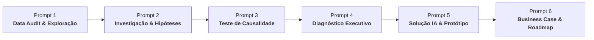
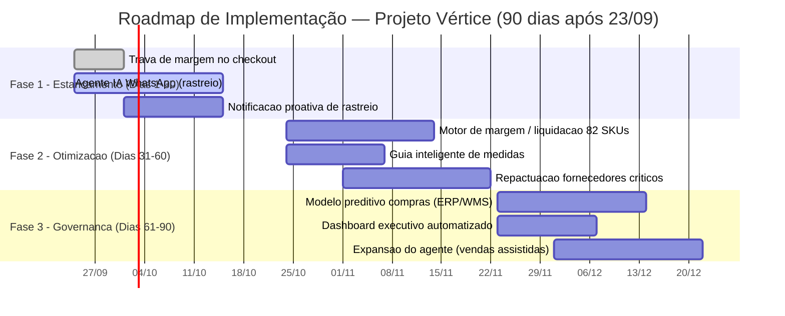

# Case Vértice Retail — AI Consulting Lab
## BootCamp Nova Geração | EloGroup (2026)

Repositório oficial do projeto final de consultoria estratégica com Inteligência Artificial e Analytics para a **Vértice Retail**, desenvolvido pelo **Grupo 18**.

---

## 👥 Integrantes — Grupo 18

| Nome | Função no Projeto | Perfil GitHub |
| :--- | :--- | :--- |
| **Ingrid Soares** | Strategy & AI Consultant | [@ingrdsoares](https://github.com/ingrdsoares) |
| **Pedro Ribeiro** | Strategy & Analytics Consultant | [@pedrorpr](https://github.com/pedrorpr) |

* **Mentoria Técnica:** Coutinho, EloGroup
* **Data da Banca / Pitch Final:** 23 de Setembro de 2026

---

## 🎯 Contexto e Pergunta Central do Case

A **Vértice Retail** é uma marca digital de moda, beleza e lifestyle voltada para jovens adultos. A empresa cresceu fortemente por meio de e-commerce próprio, redes sociais, influenciadores e marketplaces parceiros, alcançando **R$ 20,53 milhões** em faturamento bruto anual.

Entretanto, esse crescimento não tem se traduzido em geração de caixa ou expansão de margem: o capital de giro está severamente asfixiado por estoques desproporcionais, a taxa de devolução corrói o resultado operacional e o atendimento ao cliente opera sobrecarregado por tarefas manuais repetitivas.

A diretoria do cliente (CEO, CFO, CMO e COO) convocou a consultoria para responder à questão executiva:
> *"Como podemos usar dados e IA para melhorar rentabilidade, eficiência operacional e qualidade da tomada de decisão nos próximos 90 dias?"*

---

## 🧭 Metodologia & Pipeline dos Prompts (1 ao 6)

A squad adotou uma abordagem analítico-consultiva estruturada em seis etapas encadeadas, com 100% de rastreabilidade entre bases brutas, hipóteses testadas, prototipação técnica e modelagem econômico-financeira:



1. **[Prompt 1 — Data Audit e Exploração Inicial](diagnostico/01_prompt1_data_audit.md):** Auditoria e conciliação das 5 bases (`vendas.csv`, `estoque.csv`, `atendimento.csv`, `marketing.csv` e `clientes.csv`), matriz de chaves e identificação de anomalias cadastrais e de pipeline.
2. **[Prompt 2 — Investigação Aprofundada e Hipóteses](diagnostico/02_prompt2_investigacao_hipoteses.md):** Reconstrução do problema de rentabilidade, árvore de hipóteses (Issue Tree) com ramificações em Compras, Pós-Venda e Atendimento.
3. **[Prompt 3 — Teste de Hipóteses e Causa Raiz](diagnostico/03_prompt3_teste_hipoteses_causa_raiz.md):** Validação e falseamento estatístico das hipóteses, separando causa-raiz estrutural de sintomas e anomalias de dados.
4. **[Prompt 4 — Síntese Executiva do Diagnóstico](diagnostico/04_prompt4_sintese_executiva.md):** Cadeia causal quantificada (R$ 40,1M de valor destruído/ano), formulação definitiva do problema e recomendações preliminares.
5. **[Prompt 5 — Solução Técnica, Arquitetura e Protótipo de IA](diagnostico/05_prompt5_solucao_prototipo.md):** Desenho da arquitetura de IA em 4 camadas, especificação dos Módulos B (Agente de Atendimento) e C (Motor de Margem e Estoque) com guardrails de negócio e código funcional validado.
6. **[Prompt 6 — Business Case, Roadmap 30-60-90 e Pitch Executivo](diagnostico/06_prompt6_business_case_roadmap_pitch.md):** Modelagem financeira determinística com 5 alavancas auditadas (R$ 78,0M de valor capturado), cenários de sensibilidade, matriz RACI, governança de riscos e roteiro completo dos 11 slides do pitch final.

---

## 📊 Principais Diagnósticos Forenses

* **Estoque Imobilizado Crítico:** O valor do estoque físico a custo soma **R$ 348,70 milhões** frente a um CMV anual de apenas R$ 8,28 milhões e vendas de R$ 18,89 milhões líquidos. O giro anual mediano do catálogo é de míseros **0,06x** (~16,8 anos de cobertura de estoque no ritmo atual de vendas), concentrando 864 mil peças estagnadas no departamento de Moda.
* **82 SKUs Totalmente Sem Giro:** 82 produtos do catálogo possuem estoque físico positivo porém registraram exatamente **zero vendas** em 13 meses, imobilizando **R$ 6,68 milhões a custo** em capital morto.
* **Perda Operacional em Devoluções:** **4.127 pedidos devolvidos (14,87% do volume)**, sacrificando **R$ 1,52 milhão em margem de contribuição**. Dessas devoluções, **69,6% decorrem de falhas operacionais evitáveis**: *Produto com defeito (25,2%)*, *Tamanho errado (24,8%)* e *Atraso na entrega (19,6%)*.
* **Gargalo no Customer Service:** **35.841 chamados de atendimento** totalizando **R$ 532.260 em custo operacional**, dos quais **30,0% (10.765 chamados)** são simples dúvidas repetitivas de *"Onde está meu pedido?"* com tempo médio de resolução de 135 minutos — plenamente absorvíveis por IA conversacional.
* **Venda com Margem Negativa no Checkout:** **491 pedidos** foram fechados no prejuízo devido ao acúmulo descontrolado de cupons de marketing agressivos com subsídios de frete integral, destruindo **R$ 6.636,11 em margem** com margem média de **-17,2%**.

---

## 🤖 Solução com Inteligência Artificial (Prompt 5)

A solução técnica desenvolvida não é uma colcha de ferramentas pontuais, mas uma **arquitetura dual e modular** alimentada pelas mesmas bases da Vértice e protegida por guardrails estritos:

### 1. Módulo B — Agente de Atendimento ao Cliente (Customer Service Agent)
* **Triagem Inteligente N1:** Pipeline em LLM que executa classificação de intenção, análise de sentimento e cálculo de risco de churn em tempo real nos canais WhatsApp e Webchat.
* **Function Calling Automatizado:** Aciona APIs de consulta de transportadora (`consultar_status_transportadora`) e emissão imediata de logística reversa (`gerar_voucher_logistica_reversa`).
* **Human-in-the-Loop:** Transbordo mandatório para operador humano N2 quando o cliente apresenta sentimento crítico, insatisfação reiterada ou risco de churn elevado.

### 2. Módulo C — Motor de Margem e Priorização de Estoque (Margin & Inventory Optimizer)
* **Matriz 2x2 Dinâmica (Giro × Margem):** Segmenta os 5.000 SKUs do catálogo em quatro quadrantes de gestão:
  * **Q1 — Joias Escondidas (35,4% do valor, R$ 123,6M):** Alta margem, baixo giro. Ação: priorização em vitrines, mídia segmentada e combos; *sem concessão de desconto*.
  * **Q2 — Estoque Crítico (34,7% do valor, R$ 121,0M):** Baixa margem, baixo giro. Ação: liquidação programada via canal Outlet e desmobilização de capital.
  * **Q3 — Vampiros de Margem (13,9% do valor, R$ 48,5M):** Alto giro, baixa margem. Ação: renegociação de CMV e corte de subsídios de frete.
  * **Q4 — Campeões de Rentabilidade (15,9% do valor, R$ 55,6M):** Alto giro, alta margem. Ação: garantia de estoque pulmão e blindagem contra rupturas.
* **Trava Algorítmica de Checkout:** Guardrail que calcula a margem estimada da cesta (`Receita Líquida - CMV - Frete Real`) em milissegundos e veta a concessão combinada de cupom + frete quando a margem resulta negativa.
* **Trava de Preço Mínimo em Liquidação:** Garante programaticamente que nenhum desconto em campanhas ou outlets resulte em preço de venda inferior ao custo unitário do produto.

---

## 💰 Business Case & Retorno do Investimento (Prompt 6)

### 2.1 As 5 Alavancas de Captura Financeira

Todos os valores do Business Case foram calculados de forma determinística sobre as bases reais através do script [`scripts/business_case_vertice6.py`](scripts/business_case_vertice6.py):

| # | Alavanca Financeira | Premissa de Execução | Impacto Financeiro (R$/ano) | Natureza do Ganho |
|---|---|---|---:|---|
| **1** | **Desmobilização de Estoque Parado** | Liquidação controlada de 20% do estoque a custo (R$ 348,70M) via Outlet/combos em 90 dias com trava $\ge$ custo | **R$ 69.740.310,00** | Caixa livre (evento único) |
| **2** | **Economia de Custo de Carregamento** | CDI de 11,0% a.a. sobre os R$ 69,74M de capital de giro liberados | **R$ 7.671.434,00** | Redução de despesa financeira / ano |
| **3** | **Recuperação de Margem em Devoluções** | Redução de 30% nas devoluções evitáveis (defeito e tamanho) com provador virtual e homologação de fornecedores | **R$ 456.956,00** | Recuperação de margem / ano |
| **4** | **Automação do Customer Service** | Resolução automatizada de 80% dos 10.765 tickets de rastreio pelo Agente de IA | **R$ 127.728,00** | Eficiência de OpEx / ano |
| **5** | **Estancamento de Pedidos Deficitários** | Trava de checkout eliminando 100% da margem negativa dos 491 pedidos deficitários | **R$ 6.636,11** | Proteção de margem direta / ano |
| *—* | *Upside Adicional: Frete Reverso Evitado* | *Redução de 30% do custo de frete reverso gerado por devoluções evitáveis* | *R$ 37.000,00* | *Upside não somado ao headline* |
| **TOTAL** | **IMPACTO CONSOLIDADO (CENÁRIO BASE)** | **Soma exata das 5 alavancas financeiras auditadas** | **R$ 78.003.065,00** | **R$ 69,7M caixa + R$ 8,3M/ano recorrente** |

### 2.2 Análise de Sensibilidade

| Cenário | % Estoque Liquidado | % Automação SAC | % Redução Devoluções | % Captura Checkout | Impacto Total (R$) |
| :--- | :---: | :---: | :---: | :---: | :---: |
| **Conservador** | 12% | 60% | 20% | 85% | **R$ 46.853.121,00** |
| **Base** | **20%** | **80%** | **30%** | **100%** | **R$ 78.003.065,00** |
| **Otimista** | 28% | 90% | 40% | 100% | **R$ 109.136.048,00** |

* **Investimento Estimado (CapEx + OpEx 12 meses):** R$ 250.000 a R$ 350.000.
* **Payback Real (< 30 Dias):** Apenas a 1ª leva de liquidação — os **82 SKUs sem nenhuma venda** (R$ 6,68 milhões imobilizados a custo), já mapeados para liquidação imediata — cobre o investimento de R$ 350 mil em mais de **19 vezes**.

---

## 🗓️ Roadmap de Implementação 30-60-90 Dias



* **Fase 1 (Dias 1–30) — Estancamento & Quick Wins:** Subida imediata da trava algorítmica no checkout e do Agente de IA para dúvidas de rastreio no WhatsApp. Disparo de notificações proativas de despacho. Meta: zero novos pedidos deficitários e -50% no tempo de resposta do SAC.
* **Fase 2 (Dias 31–60) — Otimização de Catálogo & Recuperação de Margem:** Ativação do Motor de Margem e liquidação da primeira tranche (82 SKUs parados); implantação de guia inteligente de medidas e repactuação de qualidade com os 3 fornecedores mais reincidentes em defeitos.
* **Fase 3 (Dias 61–90) — Governança Preditiva & Escala:** Integração do modelo preditivo de compras ao ERP/WMS com base em sell-through real, publicação de dashboard executivo automatizado em camada analítica única e expansão do agente para vendas assistidas.

---

## 📁 Estrutura de Arquivos do Repositório

O repositório foi organizado de forma modular, com uma pasta dedicada para os scripts executáveis em Python:

```text
case-elo/
├── README.md                                       # Visão geral completa do projeto e resultados
├── .gitignore                                      # Regras de exclusão do git
├── orientacoes.md                                  # Diretrizes oficiais de entrega da coordenação
├── Case Vértice 1.html                             # Briefing executivo interativo do case
├── sugestoes_prompts_5_e_6.md                      # Recomendações e arquitetura para Prompts 5 e 6
├── entrega_final_vertice_grupo18.zip               # Pacote compactado de entrega oficial
├── link-github.txt                                 # Link direto do repositório remoto
│
├── scripts/                                        # Pasta dedicada a TODOS os scripts Python
│   ├── analise_vertice.py                          # Pipeline de cálculo analítico e geração de gráficos
│   ├── prototipo_ia_vertice5.py                    # Protótipo do Agente de IA e Motor de Margem (Prompt 5)
│   ├── prototipo_ia_vertice.py                     # Cópia sincronizada do protótipo de IA
│   ├── business_case_vertice6.py                   # Cálculo determinístico do Business Case e cenários (Prompt 6)
│   └── prototipo_solucao_vertice.py                # Módulos de simulação e regras de negócio
│
├── diagnostico/                                    # Relatórios técnicos formais dos Prompts 1 a 6
│   ├── 01_prompt1_data_audit.md                    # Prompt 1: Auditoria e Inventário de Dados
│   ├── 02_prompt2_investigacao_hipoteses.md        # Prompt 2: Investigação Aprofundada e Issue Tree
│   ├── 03_prompt3_teste_hipoteses_causa_raiz.md    # Prompt 3: Teste de Hipóteses e Falseabilidade
│   ├── 04_prompt4_sintese_executiva.md             # Prompt 4: Diagnóstico Executivo e Causa Raiz
│   ├── 05_prompt5_solucao_prototipo.md             # Prompt 5: Arquitetura da Solução e Protótipo de IA
│   └── 06_prompt6_business_case_roadmap_pitch.md   # Prompt 6: Business Case, Roadmap 30-60-90 e Pitch
│
├── prompts/                                        # Comandos e prompts originais (1 a 6)
│   ├── prompt1.txt                                 # Prompt 1: Data Audit
│   ├── prompt2.txt                                 # Prompt 2: Investigação
│   ├── prompt3.txt                                 # Prompt 3: Causalidade
│   ├── prompt4.txt                                 # Prompt 4: Síntese
│   ├── prompt5.txt                                 # Prompt 5: Solução IA
│   ├── prompt6.txt                                 # Prompt 6: Business Case e Pitch
│   ├── 05_pesquisa_e_resultado_prompt5.md          # Pesquisa aprofundada do Prompt 5
│   └── 06_prompt6_business_case_roadmap_pitch.md   # Relatório completo do Prompt 6
│
├── apres/                                          # Materiais para a Banca / Pitch Final (23/09)
│   ├── apresentacao_pitch_vertice_grupo18.pptx     # Deck de slides executivo (11 slides)
│   ├── roteiro_falas_pedro.txt                     # Roteiro de fala do Pedro (Diagnóstico e Dados)
│   ├── roteiro_falas_ingrid.txt                    # Roteiro de fala da Ingrid (Solução IA e Business Case)
│   └── roteiro_integrado_pitch_pedro_e_ingrid.txt  # Roteiro integrado de ensaio e transições
│
├── materiais_complementares/                       # Documentação formal compilada em múltiplos formatos
│   ├── RELATORIO_EXECUTIVO_VERTICE_GRUPO18.pdf     # Relatório Executivo em PDF
│   ├── RELATORIO_EXECUTIVO_VERTICE_GRUPO18.docx    # Relatório Executivo em Word (.docx)
│   ├── RELATORIO_EXECUTIVO_VERTICE_GRUPO18.md      # Relatório Executivo em Markdown (.md)
│   ├── relatorio_executivo_vertice_grupo18.html    # Relatório Executivo em HTML
│   └── resumo_executivo_vertice_grupo18.xlsx       # Planilha financeira em Excel (.xlsx)
│
├── charts/                                         # Gráficos forenses gerados pelo pipeline
│   ├── chart_estoque_vs_vendas.png                 # Discrepância extrema de estoque vs vendas
│   ├── chart_motivos_devolucao.png                 # Distribuição das causas operacionais de devolução
│   ├── chart_atendimento_tickets.png               # Ofensores de tempo e volume no SAC
│   └── chart_margem_desconto_canal.png             # Margem e descontos praticados por canal
│
├── atendimento.csv                                 # Base transacional de 35.841 chamados de suporte
├── clientes.csv                                    # Base cadastral de clientes e segmentação RFM
├── estoque.csv                                     # Base de 5.000 SKUs, estoque físico e custos
├── marketing.csv                                   # Base de campanhas, canais e investimento
└── vendas.csv                                      # Base de 27.755 transações comerciais e margens
```

---

## 🚀 Como Reproduzir as Análises e Executar os Scripts

### 1. Clonar o Repositório e Preparar o Ambiente
```bash
git clone https://github.com/ingrdsoares/case-elo.git
cd case-elo
pip install pandas numpy matplotlib
```

### 2. Executar o Pipeline de Análise Forense e Gráficos
```bash
python3 scripts/analise_vertice.py
```
*Gera todas as métricas no console e atualiza os 4 gráficos analíticos na pasta `charts/`.*

### 3. Executar o Protótipo Técnico de IA (Prompt 5)
```bash
python3 scripts/prototipo_ia_vertice5.py
```
*Demonstra em tempo real:*
* *Módulo B: triagem automatizada de 3 casos reais de suporte (rastreio, defeito e troca de tamanho), extração de entidades e payload de integração.*
* *Módulo C: classificação dos 5.000 SKUs nos 4 quadrantes de giro/margem, isolamento dos 82 SKUs sem giro e trava de checkout contra margem negativa.*

### 4. Executar o Cálculo Determinístico do Business Case (Prompt 6)
```bash
python3 scripts/business_case_vertice6.py
```
*Recalcula as 5 alavancas financeiras a partir das bases brutas, emite a tabela de sensibilidade (Conservador, Base e Otimista) e audita a cobertura de payback em segundos.*

---

## 📦 Conformidade com as Orientações de Entrega

Em total alinhamento com o comunicado da coordenação (`orientacoes.md`):
1. **Código e Rastreabilidade:** Repositório oficial versionado no GitHub: [https://github.com/ingrdsoares/case-elo](https://github.com/ingrdsoares/case-elo).
2. **Documentação e Materiais Complementares:** Disponibilizados em formatos padrão de mercado (`.md`, `.pdf`, `.docx`, `.xlsx`, `.pptx`) e empacotados na entrega compactada (`entrega_final_vertice_grupo18.zip`).
3. **Pitch Final Presencial (23/09):** Deck de 11 slides preparado em PowerPoint (`apres/apresentacao_pitch_vertice_grupo18.pptx`) com roteiro sincronizado de falas para os integrantes Pedro Ribeiro e Ingrid Soares.
