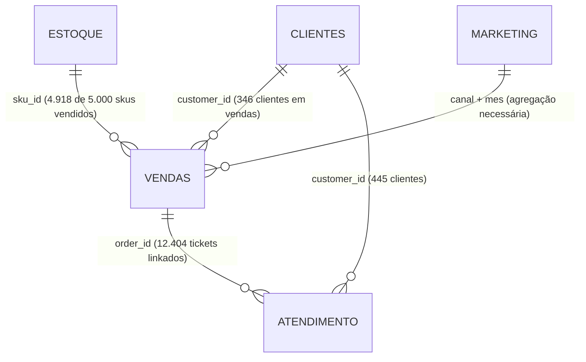

# Prompt 1 — Investigação e Diagnóstico de Dados (Data Audit)
## Projeto Vértice Retail | AI Consulting Lab — Grupo 18
**Consultores:** Ingrid Soares e Pedro Ribeiro ([@pedrorpr](https://github.com/pedrorpr))  
**Papel:** Consultoria Sênior de Estratégia e Analytics  

---

## 1. Executive Summary da Data Room

A auditoria de dados cobriu 5 bases disponibilizadas pela Vértice Retail, totalizando mais de 109 mil registros e ~14 MB de volume:

1. **`vendas.csv` (27.759 linhas, 20 colunas):** Registros transacionais de pedidos individuais de 01/01/2023 a 26/01/2024 (~13 meses). Contém faturamento bruto (R$ 20,53M), receita líquida (R$ 18,89M), CMV (R$ 8,28M), frete (R$ 340k), margem de contribuição (R$ 10,27M) e status de devoluções.
2. **`marketing.csv` (3.500 linhas, 15 colunas):** Campanhas de marketing agregadas por canal e categoria de foco de 01/01/2023 a 31/12/2025 (3 anos). Investimento acumulado de R$ 210,41M e receita reportada de R$ 878,63M.
3. **`clientes.csv` (15.000 linhas, 14 colunas):** Cadastro e perfilamento RFM de clientes com cadastros desde 01/01/2020 a 28/12/2025. LTV acumulado informado de R$ 139,09M.
4. **`atendimento.csv` (35.841 linhas, 12 colunas):** Chamados transacionais de suporte ao cliente abertos de 01/01/2023 a 31/12/2025 (3 anos), com custo operacional de R$ 532.260 e CSAT médio de 3,24/5,00.
5. **`estoque.csv` (5.000 linhas, 16 colunas):** Snapshot do inventário por SKU físico (5.000 itens), totalizando 1.671.577 peças físicas avaliadas a R$ 348,70M a custo e R$ 841,77M a preço de venda sugerido.

### Período Comum Estrito
* **Período Comum Global:** **01/01/2023 a 26/01/2024 (aprox. 13 meses)**.
* **Gargalo Temporal:** A base `vendas.csv` encerra em 26/01/2024, enquanto `marketing.csv` e `atendimento.csv` projetam dados até 31/12/2025. Para qualquer análise integrada entre vendas, campanhas e suporte, **o escopo analítico deve ser restrito a 2023-Jan/2024** para não distorcer indicadores.

---

## 2. Data Quality Assessment

| Base | Linhas | Período Coberto | Granularidade | Nulos | Duplicidades | Principais Inconsistências | Classificação de Qualidade |
| :--- | :---: | :---: | :---: | :---: | :---: | :--- | :---: |
| **`vendas.csv`** | 27.759 | 01/2023 a 01/2024 | Transacional (pedido/item) | 1 linha (trailer) | 0 IDs duplicados | 491 pedidos com margem de contribuição negativa (até -169%); 1 cliente (`CLI-11830`) concentra 40,6% dos pedidos. | **Apta com ressalvas** (tratar outlier de cliente e linha nula) |
| **`marketing.csv`** | 3.500 | 01/2023 a 12/2025 | Agregado por campanha | 0 nulos (0%) | 0 IDs duplicados | Métrica ROAS e CAC descoladas da receita real de vendas em 2023; horizonte 2 anos à frente de vendas. | **Média** (requer filtro temporal 2023) |
| **`clientes.csv`** | 15.000 | 01/2020 a 12/2025 | Por cliente único | 0 nulos (0%) | 0 IDs duplicados | Apenas 346 dos 15.000 clientes aparecem na base de vendas; contagem de pedidos no perfil não bate com transacional. | **Média** (descompasso entre base ativa e histórico) |
| **`atendimento.csv`** | 35.841 | 01/2023 a 12/2025 | Transacional (chamado) | 1 linha (trailer) | 0 IDs duplicados | Apenas 12.404 order_ids constam em `vendas.csv` devido à extensão temporal até 2025. | **Boa** (alta integridade dentro do período comum) |
| **`estoque.csv`** | 5.000 | Snapshot (até 12/2025) | Por SKU único | 0 nulos (0%) | 0 SKUs duplicados | 82 SKUs sem nenhuma venda em 13 meses; volume físico 17x superior à demanda anual. | **Boa** (snapshot íntegro, anomalia de negócio) |

---

## 3. Mapa de Integração



* **Vendas → Clientes (`customer_id`):** 100% dos pedidos possuem clientes cadastrados em `clientes.csv`. Contudo, apenas 346 clientes distintos respondem pelos 27.759 pedidos.
* **Vendas → Estoque (`sku_id`):** 100% dos pedidos possuem SKUs válidos em `estoque.csv`. Dos 5.000 SKUs do catálogo, 4.918 tiveram pelo menos 1 venda e 82 tiveram zero vendas.
* **Vendas → Atendimento (`order_id`):** Dos 35.841 tickets, 12.404 cruzam perfeitamente com os pedidos de 2023/2024. Os 23.437 tickets restantes referem-se a pedidos de 2024/2025 não contidos no recorte de vendas disponibilizado.
* **Vendas → Marketing (`canal` / `data`):** Não há chave de transação direta (`click_id` ou `utm_campaign` ausentes em vendas). A integração deve ser realizada por **agregação mensal por canal**.

---

## 4. Principais Limitações dos Dados

### Problemas Críticos
1. **Anomalia de Concentração Extrema de Clientes:** O cliente `CLI-11830` ("Theo Novais") possui 11.282 pedidos (R$ 7,69M de receita) e `CLI-01729` possui 5.664 pedidos (R$ 3,85M). Ambos compram em todos os canais simultaneamente. **Diagnóstico técnico:** Trata-se de um ID genérico ("Guest Checkout" ou cliente padrão de marketplace/PDV) utilizado pelo sistema de ERP/e-commerce para pedidos não autenticados, e não de um consumidor individual pessoa física.
2. **Truncamento Temporal Assimétrico:** `vendas.csv` termina em janeiro/2024, enquanto marketing e atendimento estendem-se até 2025.

### Problemas Moderados
1. **Ausência de Atribuição Direta em Vendas:** `vendas.csv` traz apenas o nome do canal (`Google Ads`, `Instagram Ads`, etc.), sem identificador da campanha específica de marketing.
2. **Estoque em Snapshot Estático:** A base de estoque representa a posição física atual, não permitindo visualizar a série histórica diária de estoque ao longo de 2023.

---

## 5. Principais Achados & Padrões Iniciais

1. **Volume de Devoluções Concentrado em Falhas de Qualidade e Operação:** 4.127 devoluções (14,87% dos pedidos). A receita líquida devolvida é de R$ 2,82M e a margem bruta sacrificada é de R$ 1,52M. Os principais motivos são *Defeito* (25,2%), *Tamanho Errado* (24,8%) e *Atraso* (19,6%).
2. **Estoque Superdimensionado em Moda:** O estoque de Moda soma 864.572 peças para uma venda anual de ~34.000 peças.
3. **Custo de Atendimento Pressionado por Rastreamento:** 30% dos chamados são "Onde está meu pedido?", consumindo R$ 159.660 em custo operacional com operadores humanos.

---

## 6. Possíveis Problemas de Negócio Identificados

* **Problema A (Capital Imobilizado):** R$ 348,7M de estoque parado em custo frente a um CMV anual de R$ 8,28M.
* **Problema B (Erosão de Margem por Devolução):** 15% de taxa de devolução com perda direta de margem e frete reverso.
* **Problema C (Ineficiência Operacional no Atendimento):** R$ 532k gastos em atendimento reativo e manual, com baixa resolução no primeiro contato e demora de 135 minutos para responder dúvidas básicas de entrega.

---

## 7. Árvore de Hipóteses Preliminar

```text
Pressão sobre Rentabilidade e Eficiência (Vértice Retail)
├── 1. Margem e Precificação
│   ├── Concessão excessiva de descontos em campanhas promocionais
│   ├── Pedidos com frete subsidiado gerando margem negativa
│   └── Descasamento de mix de produtos
├── 2. Operações e Supply Chain
│   ├── Superdimensionamento de compras em relação à demanda real (Estoque 42x CMV)
│   ├── Ineficiência logística gerando atrasos e devoluções
│   └── Falhas no controle de qualidade de fornecedores (defeitos nos produtos)
├── 3. Experiência e Customer Service
│   ├── Falta de autosserviço para rastreio de entregas (30% dos tickets)
│   └── Processo manual de troca e devolução
└── 4. Governança e Dados
    ├── Guest checkouts agregados em poucos IDs no ERP
    └── Descentralização das decisões de compra e marketing
```

---

## 8. Hipóteses Prioritárias para Brainstorming

| Hipótese | Evidência a Favor | Evidência Contra | Dados Faltantes | Pergunta para Brainstorming |
| :--- | :--- | :--- | :--- | :--- |
| **H1: Superestocagem descontrolada imobiliza capital de giro** | Estoque a custo (R$ 348,7M) é 42x maior que o CMV anual (R$ 8,28M). 82 SKUs com zero giro. | Custo unitário médio dos SKUs é estável (~R$ 207). | Série temporal histórica de entradas de compras e capacidade física de CD. | O estoque atual representa erro de planejamento de compras ou estoque de múltiplos canais/franquias não integrados? |
| **H2: Devoluções operacionais destroem R$ 1,5M de margem** | 69,6% das devoluções são causadas por defeito, tamanho errado e atraso logístico. | Taxa de devolução é razoavelmente homogênea entre os 4 departamentos (~14-15%). | Taxa de refugo dos produtos devolvidos e custo de frete reverso real. | A tabela de medidas e o controle de qualidade dos fornecedores de Moda/Beleza estão sendo fiscalizados? |
| **H3: Atendimento manual infla custos operacionais** | 10.765 tickets de simples rastreio de pedido custam R$ 159k e levam 135 min para resposta. | CSAT médio não é desastroso (3,24/5,00). | Custo de implementação de API de WhatsApp com chatbot integrado. | Por que o status de rastreio não é enviado proativamente via WhatsApp/E-mail no despacho? |

---

## 9. Perguntas que o Time Deve Responder no Brainstorming

1. *Como reverter o capital imobilizado de R$ 348M em estoque sem destruir a margem com liquidações predatórias?*
2. *Quais ações na ficha do produto (guia de medidas 3D, fotos reais, avaliações) podem reduzir as devoluções por tamanho e expectativa?*
3. *Como um agente inteligente de IA generativa integrado ao WhatsApp pode assumir 60%+ da triagem de atendimento imediatamente?*
4. *Como segregar as vendas de "Guest Checkout" no Data Warehouse para que a segmentação de clientes RFM reflita consumidores reais?*

---

## 10. Próximas Análises Recomendadas

* **Análise 1:** Giro de estoque e dias de cobertura por SKU individual para criar curva ABC de liquidação prioritária.
* **Análise 2:** Correlação entre tempo de entrega (`tempo_entrega_real`) e probabilidade de devolução/ticket de atraso.
* **Análise 3:** Simulação financeira da economia obtida pela automação de 80% dos chamados de rastreio e 50% dos chamados de dúvidas técnicas via agente de IA.
