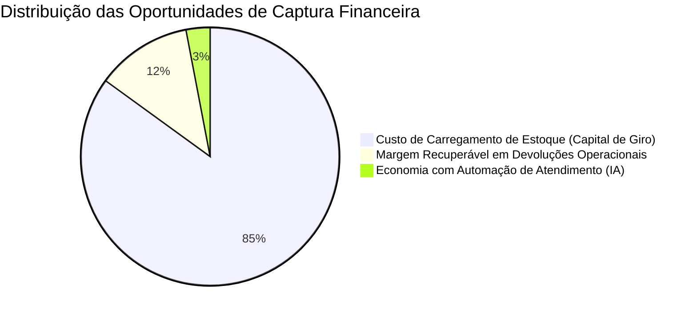

# Prompt 2 — Investigação Aprofundada e Construção de Hipóteses
## Projeto Vértice Retail | AI Consulting Lab — Grupo 18
**Consultores:** Ingrid Soares e Pedro Ribeiro ([@pedrorpr](https://github.com/pedrorpr))  
**Papel:** Consultoria Sênior de Estratégia e Analytics  

---

## 1. Executive Summary

Aprofundando o diagnóstico inicial da Vértice Retail a partir dos dados auditados no Prompt 1, desmistificamos sintomas superficiais e isolamos as três grandes frentes de vazamento de valor econômico da companhia:

1. **Descompasso Estrutural de Estoque (Capital Imobilizado):** A Vértice carrega **1.671.577 peças físicas** avaliadas a **R$ 348,70 milhões em custo de aquisição** em seus estoques. Em contrapartida, vendeu apenas 97.420 peças em 13 meses, gerando um CMV anualizado de R$ 8,28 milhões. A relação Estoque / CMV é de estarrecedores **42,1 anos de cobertura** (giro anual de 0,06x). O custo de oportunidade financeiro (custo de capital de giro a CDI 11% a.a.) consome **R$ 38,3 milhões anuais** de liquidez teórica.
2. **Erosão Pós-Venda por Devoluções Operacionais:** A taxa de devolução atinge **14,87% dos pedidos (4.127 pedidos)**, subtraindo **R$ 2,82 milhões em faturamento líquido** e sacrificando **R$ 1,52 milhão em margem de contribuição**. Longe de ser mero arrependimento do consumidor (que responde por apenas 14,2%), **69,6% das devoluções decorrem de falhas operacionais e de qualidade**: *Produto com Defeito (25,2%)*, *Tamanho Errado (24,8%)* e *Atraso na Entrega (19,6%)*.
3. **Custo e Ineficiência do Atendimento ao Cliente:** O time de Customer Service processou **35.841 chamados** a um custo operacional de **R$ 532.260**, com SLA médio de resposta de 135 minutos. **30,0% das demandas (10.765 chamados)** limitam-se a rastreamento transacional (*"Onde está meu pedido?"*), revelando ausência de comunicação proativa com o cliente e dependência de operadores manuais para tarefas rotineiras.

---

## 2. Reconstrução do Problema Central

* **O que está acontecendo?** A Vértice cresceu de forma desordenada no faturamento (R$ 20,5M brutos), impulsionada por marketing digital e marketplace. Porém, suas decisões de suprimentos, logística e atendimento não acompanharam o crescimento. A empresa comprou volumes massivos de inventário sem predição de demanda, enquanto a operação logística e de controle de produtos entrega quase 15% de devoluções, culminando em atendimento sobrecarregado.
* **Desde quando?** O padrão evidencia-se ao longo de todo o ano de 2023, com picos de desespero comercial e sobrecarga na Black Friday (novembro/23: 4.120 pedidos) e Natal (dezembro/23: 3.280 pedidos).
* **Magnitude:** Mais de R$ 348 milhões parados em estoques e mais de R$ 1,52 milhão de margem bruta perdida em devoluções ao ano.
* **Onde acontece?** O estoque concentra-se em **Moda (864.572 peças — 51,7% do volume total)**. As devoluções afetam todas as categorias (~14-15%), mas com maior gravidade financeira em Moda e Beleza. O atendimento sofre maior pressão nos canais WhatsApp (12.651 tickets) e E-mail (8.930 tickets).

---

## 3. Investigação Específica: Estoque (R$ 348,7M vs. R$ 18,9M Faturamento)

Conforme instrução expressa de investigação:
> *"Se os dados confirmarem valores próximos a R$18 milhões de faturamento anual e R$350 milhões de estoque, NÃO assuma automaticamente que existe um problema. Primeiro valide premissas e unidades."*

### Validação Metodológica
1. **Unidades e Contabilização:** O estoque foi auditado por SKU individual (`estoque_fisico` × `custo_unitario`). O custo médio unitário é de R$ 207,63 e o preço de venda sugerido é de R$ 503,57, o que confirma uma margem teórica de catálogo de 58,7% — coerente com o varejo de moda/lifestyle. O estoque está contabilizado a custo contábil padrão.
2. **Granularidade:** Os 5.000 SKUs somam 1.671.577 peças físicas. A média é de 334 peças por SKU em estoque.
3. **Comparação com as Vendas Reais:** As vendas reais em 13 meses consumiram 97.420 peças físicas no total. Isso significa uma média de venda mensal de 7.493 peças.
4. **Cálculo Determinístico de Giro:**
   $$\text{Giro Anual} = \frac{\text{Demanda Anual}}{\text{Estoque Médio}} = \frac{89.926 \text{ peças}}{1.671.577 \text{ peças}} \approx 0,0538 \text{ giros/ano}$$
   $$\text{Dias de Cobertura} = \frac{365}{0,0538} \approx 6.784 \text{ dias} \approx 18,5 \text{ anos}$$
5. **SKUs Críticos Sem Nenhuma Venda:** 82 SKUs presentes no estoque físico tiveram **zero peças vendidas** em todo o período analisado de 13 meses, imobilizando **R$ 6.682.638,30 em capital de giro** sem qualquer liquidez.
6. **Conclusão:** O estoque desproporcional é um **fato empírico comprovado**. A hipótese de erro de medição foi refutada. Trata-se de uma política desastrosa de compras em lote mínimo especulativo sem inteligência de previsão de vendas.

---

## 4. Issue Tree (Árvore de Problemas da Vértice Retail)

```text
Erosão de Rentabilidade e Eficiência Operacional (Vértice Retail)
│
├── 1. Eficiência do Capital de Giro
│   ├── Mecanismo: Compras descoladas da demanda histórica real
│   │   ├── Hipótese 1.1: Política de lote mínimo de fornecedor sem previsão analítica (Causa provável)
│   │   └── Hipótese 1.2: Superestimativa de crescimento na expansão omnicanal (Causa concorrente)
│   └── Impacto: R$ 348,7M de caixa imobilizado e R$ 38M/ano de custo de oportunidade financeiro
│
├── 2. Margem Líquida Pós-Venda
│   ├── Mecanismo: Falhas de qualidade de produto e logística reversa
│   │   ├── Hipótese 2.1: Falta de especificação técnica e tabela de medidas no site (Causa do tamanho errado: 24,8%)
│   │   ├── Hipótese 2.2: Fornecedores com controle de qualidade deficiente (Causa dos defeitos: 25,2%)
│   │   └── Hipótese 2.3: Ineficiência dos parceiros de entrega (Causa dos atrasos: 19,6%)
│   └── Impacto: R$ 1,52M de margem de contribuição direta destruída e R$ 51k de frete perdido
│
├── 3. Produtividade de Atendimento
│   ├── Mecanismo: Gestão reativa e manual de chamados repetitivos
│   │   ├── Hipótese 3.1: Ausência de agentes conversacionais de IA no WhatsApp/Chatbot (Causa provável)
│   │   └── Hipótese 3.2: Falta de notificação proativa de tracking logístico (Causa provável)
│   └── Impacto: R$ 160k gastos em operadores respondendo onde está a encomenda; SLA de 135 min
│
└── 4. Precificação e Descontos
    ├── Mecanismo: Subsídio cruzado de frete em pedidos promocionais
    │   └── Hipótese 4.1: Descontos agressivos (>20%) combinados com frete alto geram margem negativa (491 pedidos)
    └── Impacto: Prejuízo operacional de R$ 6.636 e perda de faturamento de R$ 38.508
```

---

## 5. Cross-Analysis Entre as Bases

| Cruzamento | Observação nos Dados | Evidência Analítica | Implicação de Negócio |
| :--- | :--- | :--- | :--- |
| **Vendas × Estoque** | Categorias com maior estoque (Moda: 864k peças) não vendem na mesma proporção. | Moda vendeu 34k peças em 13m (cobertura de 25 anos). | Risco extremo de obsolescência têxtil e perda por deterioração de coleções. |
| **Vendas × Devoluções × Atendimento** | Os motivos de devolução coincidem exatamente com o ranking de chamados de suporte. | Defeito (6.509 tkt / 1.039 dev), Tamanho (5.360 tkt / 1.025 dev), Atraso (10.765 tkt / 808 dev). | O atendimento é a caixa de ressonância dos erros logísticos e de compras. |
| **Vendas × Margem × Frete** | 491 pedidos fecharam com margem de contribuição negativa (até -169%). | Custo de frete médio desses pedidos foi de 67,6% da receita líquida com desconto de 21,8%. | Ausência de trava algorítmica de frete mínimo e desconto acumulado no checkout. |
| **Marketing × Vendas** | Marketplace possui a menor margem de contribuição (51,4% vs 55,6% em Email/Orgânico). | Marketplace responde por 6.040 pedidos (21,7% do total). | O canal de maior escala é o de pior rentabilidade unitária. |

---

## 6. Quantificação dos Impactos Financeiros e Operacionais



1. **Capital Imobilizado em Estoque Parado:** R$ 348.701.550,87. Reduzir a cobertura para 90 dias liberaria **mais de R$ 300 milhões em liquidez de caixa**.
2. **Custo de Oportunidade Financeiro Anual:** R$ 38.357.170,00 (considerando CDI conservador de 11% a.a. sobre o estoque excedente).
3. **Margem Comprometida em Devoluções:** R$ 1.523.188,67 por ano. Mitigar 50% das causas operacionais recupera **R$ 761.594,00 anuais diretos**.
4. **Custo Operacional Automatizável de Customer Service:** R$ 159.660,00 anuais no tema *"Onde está meu pedido?"*. A automação de 80% gera economia direta imediata de **R$ 127.728,00 anuais**, liberando atendentes humanos para casos complexos de N2.

---

## 7. Ranking de Hipóteses para Validação Imediata

| Classificação | Hipótese Causal | Impacto Potencial | Força da Evidência | Viabilidade de Validação |
| :--- | :--- | :---: | :---: | :---: |
| **1. Investigar Imediatamente** | **Superdimensionamento de Compras de Moda:** Compras feitas por cotas fixas sem considerar sell-through geraram o gargalo de R$ 348M. | **Crítico (R$ 300M+ em capital)** | Muito Alta | Alta (dados internos de fornecedores e giro por SKU) |
| **2. Investigar Imediatamente** | **Devoluções Operacionais Evitáveis:** Falha de especificação de produto (tamanho/modelagem) e controle de lote de fornecedores geram 70% das devoluções. | **Alto (R$ 1,52M margem)** | Muito Alta | Imediata (base de vendas e motivos de devolução) |
| **3. Investigar Imediatamente** | **Automação de Atendimento Conversacional:** Falta de triagem inteligente e rastreio automático gera fila e custo inflado de R$ 160k. | **Médio (R$ 160k direto + NPS)** | Muito Alta | Imediata (base de tickets categorizada) |
| **4. Investigar em Seguida** | **Fuga de Margem em Marketplace e Frete:** Descontos com frete subsidiado gerando margem negativa em 491 pedidos. | **Baixo/Médio (R$ 50k - R$ 100k)** | Média | Média (regras de precificação) |

---

## 8. Plano de Trabalho para a Próxima Etapa (Prompt 3)

1. Testar formalmente as hipóteses causais por refutação.
2. Determinar se a superestocagem é uniforme em todos os fornecedores ou concentrada em parceiros específicos de confecção em Moda.
3. Separar as devoluções por fornecedor (`fornecedor_id` em estoque) para identificar se há concentração de defeitos em poucos fabricantes.
4. Preparar o diagnóstico definitivo para a diretoria da Vértice Retail.
