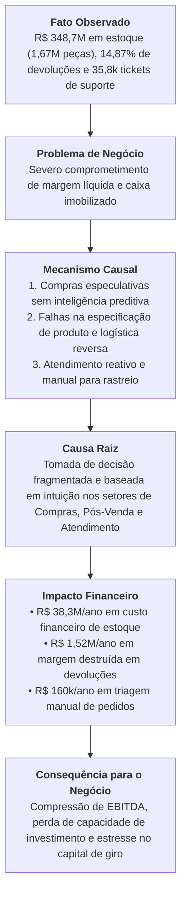

# Prompt 4 — Síntese do Diagnóstico e Definição do Problema de Negócio
## Projeto Vértice Retail | AI Consulting Lab — Grupo 18
**Consultores:** Ingrid Soares e Pedro Ribeiro ([@pedrorpr](https://github.com/pedrorpr))  
**Papel:** Liderança do Diagnóstico Estratégico  

---

## 1. Cadeia Causal Integrada

A análise cruzada das cinco bases da Vértice Retail demonstra que a deterioração da rentabilidade não decorre de enfraquecimento comercial, mas sim de uma cadeia causal de atrito operacional e planejamento desarticulado:

---

## 2. Definição Executiva do Problema de Negócio

> *"A Vértice Retail está enfrentando **compressão severa de rentabilidade e asfixia de capital de giro**, causada principalmente por **compras de suprimentos sem previsão de demanda analítica (gerando 42 anos de cobertura em estoque)**, combinadas com **atrito operacional pós-venda (15% de devoluções por defeito e erro de tamanho) e suporte reativo analógico**, resultando em **mais de R$ 39,8 milhões anuais de valor destruído entre custo de carregamento financeiro de estoque, margem perdida em devoluções e custos operacionais de triagem manual**."*

---

## 3. Quantificação Consolidada do Problema

| Dimensão Estratégica | Métrica Mensurada nos Dados | Impacto Financeiro / Operacional | Observações e Premissas |
| :--- | :--- | :--- | :--- |
| **Capital Imobilizado em Estoque** | 1.671.577 peças físicas (R$ 348.701.550,87 a custo contábil) | **R$ 38.357.170,59 / ano** em custo de carregamento financeiro | Considera CDI conservador de 11,0% a.a. sobre o excesso de estoque acima de 90 dias de cobertura. |
| **Margem Perdida em Devoluções** | 4.127 pedidos devolvidos (14,87% do volume total de vendas) | **R$ 1.523.188,67 / ano** em margem bruta sacrificada | 69,6% decorrem de motivos evitáveis (defeito, tamanho incorreto e atrasos). |
| **Frete Perdido em Devoluções** | 4.127 ocorrências de frete de ida não recuperado | **R$ 51.006,15 / ano** direto (+ frete reverso estimado em R$ 75k) | Custo logístico direto sem contrapartida de receita retida. |
| **Custo de Triagem de Atendimento** | 10.765 tickets de *"Onde está meu pedido?"* (30,0% do suporte) | **R$ 159.660,00 / ano** em tempo de operadores humanos | Tempo médio de resposta atual de 135 minutos com CSAT médio de 3,24. |
| **Pedidos com Margem Negativa** | 491 transações subsidiando frete e desconto excessivo | **R$ 38.508,04 / ano** em receita líquida com margem de -17,2% | Pedidos onde o frete representou >67% da receita com descontos superiores a 20%. |
| **TOTAL DO VALOR EM RISCO / ANO** | — | **R$ 40.129.525,41 / ano** | Oportunidade prioritária de recuperação de liquidez e margem. |

---

## 4. Separação Rigorosa: Causa vs. Mecanismo vs. Sintoma

| Elemento do Negócio | Classificação | Evidência Empírica nos Dados |
| :--- | :---: | :--- |
| **Estoque de 1,67 milhão de peças (R$ 348M a custo)** | **Causa Raiz Estrutural** | Relação Estoque/CMV anual de 42x; 82 SKUs com zero venda em 13 meses imobilizando R$ 6,68M. |
| **Ausência de Guia de Medidas Preciso e Controle de Fornecedores** | **Causa Raiz Operacional** | 1.039 devoluções por defeito (25,2%) e 1.025 por tamanho errado (24,8%), totalizando 50% das devoluções. |
| **Ausência de Triagem Inteligente e Tracking Proativo no Pós-Venda** | **Causa Raiz de Produtividade** | 10.765 chamados de suporte perguntando "onde está o pedido", sobrecarregando 30% da equipe de SAC. |
| **491 pedidos com margem negativa** | **Mecanismo Comercial** | Combinação descontrolada de frete fixo alto com cupom de desconto em carrinhos de baixo valor unitário. |
| **35.841 chamados de atendimento ao cliente** | **Sintoma Operacional** | Reflexo das falhas de entrega, produtos defeituosos e insegurança no prazo de entrega. |
| **Sensação de baixa rentabilidade pela diretoria** | **Sintoma Executivo** | Drenagem do lucro operacional provocada pelo frete reverso, descontos corretivos e custo de oportunidade do capital. |

---

## 5. Decisões Estratégicas que Precisam Ser Transformadas nos Próximos 90 Dias

Para responder à pergunta desafiadora da diretoria:
> *"Que decisões a Vértice está tomando mal, tarde demais ou sem informação suficiente?"*

Identificamos as quatro decisões críticas que demandam suporte imediato de IA e Analytics:

1. **Decisão de Planejamento de Compras (O que comprar e quanto comprar):**
   * *Como é tomada hoje:* Decisão semestral em grandes lotes mínimos com fornecedores, baseada em feeling comercial e metas de crescimento otimistas.
   * *Como deve ser tomada:* Decisão algorítmica semanal baseada em **velocidade real de sell-through, curva ABC de margem e dias de cobertura por SKU**.
2. **Decisão de Liquidação e Precificação Dinâmica (Quais SKUs promover e com quanto desconto):**
   * *Como é tomada hoje:* Promoções genéricas concedendo cupons para toda a loja ou canal, subsidiando SKUs de alta demanda e gerando pedidos deficitários.
   * *Como deve ser tomada:* Descontos seletivos orientados por **motor de priorização de margem**, liquidando exclusivamente SKUs sem giro (>180 dias de estoque) com trava de margem mínima.
3. **Decisão de Triagem e Resolução no Atendimento (O que automatizar e o que priorizar):**
   * *Como é tomada hoje:* Atendentes humanos lendo e respondendo fila cronológica de chamados, levando mais de 2 horas para consultar um código de rastreamento.
   * *Como deve ser tomada:* Agente inteligente de IA que **classifica a intenção do cliente, consulta a API logística em tempo real e responde 80%+ das dúvidas de rastreamento em menos de 10 segundos**.
4. **Decisão de Gestão de Devoluções e Homologação de Fornecedores:**
   * *Como é tomada hoje:* Recebimento passivo das devoluções sem feedback estruturado aos times de produto e compras.
   * *Como deve ser tomada:* Painel executivo identificando fornecedores reincidentes em defeitos para bloqueio de compras e reformulação imediata das fichas de modelagem no e-commerce.

---

Este diagnóstico conclusivo estabelece a fundação exata para a concepção da **Solução de IA (Prompt 5)** e do **Business Case & Roadmap de 90 dias (Prompt 6)**.
