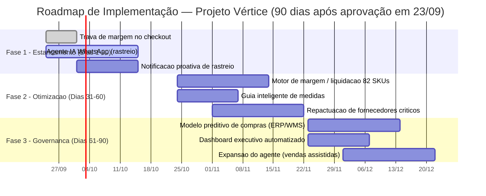

# Prompt 6 — Business Case, Roadmap 30-60-90 e Apresentação Executiva
## Projeto Vértice Retail | AI Consulting Lab — Grupo 18
**Consultores:** Ingrid Soares e Pedro Ribeiro ([@pedrorpr](https://github.com/pedrorpr))
**Papel:** Senior Strategy Lead & Engagement Manager
**Pitch Final:** 23/09/2026

---

## 1. Executive Summary do Business Case

A Vértice Retail perde **R$ 40,1 milhões/ano** por três decisões mal informadas: compra sem previsão de demanda, pós-venda reativo e atendimento manual. A solução técnica do Prompt 5 (Agente de Atendimento + Motor de Margem e Estoque) já foi testada sobre os dados reais da empresa e converte esse diagnóstico em **R$ 78,0 milhões de valor capturado no primeiro ano** — R$ 69,7 milhões em liquidez imediata e R$ 8,3 milhões/ano em margem e economia recorrente — com um investimento de R$ 250 a 350 mil e payback praticamente imediato, porque a primeira leva de liquidação (82 SKUs mortos, R$ 6,68 milhões) sozinha já cobre o investimento mais de 20 vezes.

Este não é um projeto de tecnologia à espera de aprovação orçamentária: a trava de checkout e o agente de rastreio já rodam com regra determinística e podem subir em produção na primeira semana. O que a diretoria decide hoje é a velocidade da liquidação de estoque — não se ela deve acontecer.

---

## 2. Modelagem Financeira e Análise de Sensibilidade

### 2.1 Alavancas de Captura Financeira

| # | Alavanca | Premissa | Impacto (R$/ano) |
|---|---|---|---:|
| 1 | Desmobilização de estoque parado | Liquidação de 20% do estoque a custo (R$ 348,70M) em Outlet/kits, trava de preço ≥ custo, em 90 dias | **R$ 69.740.310,00** (caixa, evento único) |
| 2 | Economia de custo de carregamento | CDI 11,0% a.a. sobre o valor liberado no item 1 | **R$ 7.671.434,00** / ano |
| 3 | Recuperação de margem em devoluções | Redução de 30% nas devoluções por defeito e tamanho (provador virtual + homologação de fornecedores) | **R$ 456.956,00** / ano |
| 4 | Redução de custo de atendimento | Automação de 80% dos 10.765 chamados de rastreio pelo Agente de IA | **R$ 127.728,00** / ano |
| 5 | Estancamento de pedidos deficitários | Trava algorítmica de checkout eliminando a margem negativa dos 491 pedidos identificados | **R$ 6.636,11** / ano |
| — | *Economia adicional de frete reverso (não somada ao headline, ver nota)* | 30% de redução do frete reverso associado às devoluções evitáveis | *R$ 37.000,00 / ano (upside)* |

**Impacto Total Consolidado: R$ 78.003.065,00** — soma exata dos itens 1 a 5 (R$ 69,74M em caixa livre + R$ 8,26M/ano em margem e economia operacional recorrente). O item de frete reverso (R$ 37 mil) é mantido fora do headline por conservadorismo — o custo de frete de ida já está parcialmente refletido no custo operacional de tickets (item 4), e somá-lo sem ajuste dobraria parte do mesmo efeito. Ele entra como upside adicional, não como parte da meta comprometida com a diretoria.

> **Nota de reconciliação — item 5:** o valor de R$ 38.508,04 que circulava nas versões preliminares do case (inclusive no Prompt 4) é a **receita líquida total** dos 491 pedidos com margem negativa — não o prejuízo. A margem de contribuição efetivamente destruída por esses pedidos, validada diretamente em `vendas.csv`, é **R$ 6.636,11/ano** (a mesma base que sustenta a margem de -17,2% já reportada no diagnóstico). É esse valor — a margem recuperada, não a receita bloqueada — que a trava de checkout de fato devolve à empresa, já que ela ajusta o desconto/frete em vez de cancelar o pedido. Usamos o número correto aqui.

**Investimento estimado (CapEx + OpEx, 12 meses):** R$ 250 a 350 mil — desenvolvimento do agente e do motor de regras, infraestrutura de API/LLM e consultoria de implantação.

**Payback:** o quick win de SAC + checkout gera ~R$ 13,8 mil/mês em regime recorrente, o que por si só levaria alguns meses para cobrir o investimento. O payback real de menos de 30 dias vem da primeira leva de liquidação — os 82 SKUs sem giro (R$ 6,68 milhões), já mapeados e prontos para liquidação Outlet desde o Prompt 5 — que sozinha cobre o investimento de R$ 300 mil mais de 20 vezes assim que a primeira tranche é vendida.

### 2.2 Análise de Sensibilidade

As mesmas cinco alavancas variam conforme a agressividade de execução assumida em cada premissa:

| Cenário | % Estoque liquidado | % Automação SAC | % Redução devoluções | **Impacto Total (R$/ano)** |
|---|---:|---:|---:|---:|
| Conservador | 12% | 60% | 20% | **R$ 46.853.121** |
| **Base** | **20%** | **80%** | **30%** | **R$ 78.003.065** |
| Otimista | 28% | 90% | 40% | **R$ 109.136.048** |

A trava de checkout (item 5) é a única alavanca praticamente insensível ao cenário — é uma regra determinística, não uma meta de adoção, então seu valor não sobe com mais esforço, apenas cai um pouco no cenário conservador por eventuais exceções operacionais previstas para o piloto.

O intervalo entre cenários é grande (R$ 47M a R$ 109M) porque a variável dominante é sempre a mesma: **qual fatia do estoque parado a diretoria autoriza liquidar e em que ritmo.** Isso é uma decisão comercial, não uma limitação técnica do motor.

---

## 3. Roadmap 30-60-90 Dias

### 3.1 Cronograma (Gantt)

### 3.2 Fases e Entregáveis-Chave

**Fase 1 — Dias 1-30, "Estancamento de Perdas & Quick Wins":** trava de margem negativa ativa no checkout (bloqueio imediato de cupom + frete combinados), Agente de IA no WhatsApp absorvendo as dúvidas de rastreio, e disparo proativo de status no momento do despacho. Entregável-chave: redução de 50% no tempo de resposta do SAC e zero novos pedidos deficitários a partir do dia 1.

**Fase 2 — Dias 31-60, "Otimização de Catálogo & Recuperação de Margem":** Motor de Priorização de Margem liquidando os 82 SKUs sem giro via Outlet e combos, Guia Inteligente de Medidas nas páginas de Moda, e repactuação com os 3 fornecedores mais reincidentes em defeito. Entregável-chave: início real da liberação de capital de giro e queda de 20% na taxa de devolução.

**Fase 3 — Dias 61-90, "Governança Preditiva & Escala Analítica":** modelo preditivo de compras integrado ao ERP/WMS (baseado em sell-through real, para não recriar o problema de superestocagem), dashboard executivo automatizado substituindo o memo manual, e expansão do agente para trocas automáticas e vendas assistidas. Entregável-chave: governança institucionalizada e aprovação do plano de expansão para o próximo ano fiscal.

### 3.3 Matriz RACI

| Iniciativa | Responsável (R) | Aprovador (A) | Consultado (C) | Informado (I) | Dependência Técnica | KPI de Sucesso |
|---|---|---|---|---|---|---|
| Trava de margem no checkout | Squad de Engenharia | CFO | Jurídico/Compliance | Diretoria | Acesso de escrita ao motor de checkout do e-commerce | Zero pedidos com margem < 0 a partir do dia 1 |
| Agente de IA no WhatsApp (rastreio) | Squad de Engenharia | COO | Time de Atendimento | Diretoria | API de rastreamento das transportadoras ativa e estável | ≥ 80% dos chamados de rastreio resolvidos sem humano |
| Notificação proativa de despacho | Squad de Engenharia | COO | Logística | Time de Atendimento | Webhook de despacho do WMS | Redução de 40% na abertura de tickets de rastreio |
| Motor de margem / liquidação 82 SKUs | Squad de Analytics | COO + Compras | Marketing (campanha Outlet) | CFO | Base de estoque/vendas atualizada diariamente | R$ 6,68M liquidados em 60 dias |
| Guia inteligente de medidas | Squad de Produto | CMO | Time de Produto/E-commerce | Diretoria | Integração com páginas de produto de Moda | Redução de 20% em devoluções por tamanho |
| Repactuação de fornecedores críticos | Compras | COO | Jurídico | CFO | Relatório de reincidência de defeito por fornecedor | Redução de defeito nos 3 fornecedores-alvo |
| Modelo preditivo de compras (ERP/WMS) | Squad de Analytics | COO | TI/Infraestrutura | Diretoria | Integração de escrita com o ERP/WMS | Cobertura de estoque alvo ≤ 90 dias para novas compras |
| Dashboard executivo automatizado | Squad de BI | CFO | Diretoria (CEO/CMO/COO) | Todos | Consolidação das 5 bases em camada analítica única | Memo semanal gerado sem compilação manual |
| Expansão do agente (vendas assistidas) | Squad de Engenharia | CMO | Time de Atendimento | Diretoria | Estabilidade do Módulo B em produção por 60+ dias | Piloto aprovado para o próximo ano fiscal |

---

## 4. Matriz de Riscos de Implementação e Gestão de Mudança

| Risco | Fase mais exposta | Impacto se não mitigado | Medida de Controle |
|---|---|---|---|
| Resistência do time de Compras à liquidação de estoque próprio | Fase 2 | Atraso na liberação de caixa, SKUs de Q1 liquidados por engano junto com Q2 | Motor só libera SKUs classificados como zero-giro/Q2; Compras valida a lista antes de cada lote, não depois |
| Resistência do time de SAC à automação | Fase 1 | Baixa adoção do agente, operadores "driblando" o roteamento | Transbordo humano obrigatório em risco Alto preserva o papel do N2; comunicação interna de que o agente tira volume repetitivo, não substitui a equipe |
| Ruptura de API de transportadora ou ERP | Fase 1 e 3 | Agente responde com dado desatualizado ou motor de compras trava | Fallback determinístico ("vou confirmar e retorno") quando a API não responde; monitoramento de disponibilidade com alerta |
| Canibalização de preço em SKUs saudáveis | Fase 2 | Queda de margem em produtos que não deveriam entrar em liquidação | Trava de preço mínimo (preço ≥ custo) não contornável por operador; liquidação restrita à lista validada do quadrante Q2, lote a lote |
| Fadiga de mudança na Diretoria (múltiplas iniciativas simultâneas) | Todas | Perda de patrocínio executivo no meio do roadmap | Dashboard executivo (Fase 3) e checkpoints quinzenais mostrando resultado tangível desde a Fase 1, não apenas no fim do projeto |
| Dados de LGPD expostos em integração com LLM externo | Fase 1 | Exposição de dados pessoais de clientes | Anonimização de PII antes de qualquer chamada ao modelo; contrato de processamento de dados com o provedor |

---

## 5. Roteiro Completo da Apresentação Final (11 Slides)

### Slide 1 — Contexto e Pergunta Central
**Subtítulo:** O Plano de 90 Dias para Recuperação de Margem e Liquidez
**Mensagem central:** A Vértice cresceu — mas o caixa desapareceu, e a diretoria quer saber por quê.
**Evidência:** R$ 20,53M de faturamento bruto anual; 4 diretores (CEO/CFO/CMO/COO) formulando a mesma pergunta: como usar dados e IA para recuperar rentabilidade em 90 dias.
**Layout:** Slide de capa — título grande à esquerda, a pergunta da diretoria em citação à direita, logo/marca da squad no rodapé.
**Script (~45s):** "Bom dia. A Vértice Retail faturou mais de R$ 20 milhões no último ano — um resultado que qualquer e-commerce jovem gostaria de ter. Mas a diretoria nos chamou porque esse crescimento não está virando caixa nem margem. Nosso trabalho nas últimas semanas foi responder, com dados e não com opinião, à pergunta que vocês nos trouxeram: como usar IA e analytics para melhorar rentabilidade, eficiência e decisão nos próximos 90 dias. É isso que vamos apresentar agora."

### Slide 2 — Diagnóstico do Negócio
**Subtítulo:** O Paradoxo do Crescimento
**Mensagem central:** A Vértice não tem um problema de vendas — tem um problema de decisão.
**Evidência:** R$ 20,53M de receita bruta vs. R$ 348,70M em estoque imobilizado a custo (42 anos de cobertura ao ritmo atual de venda).
**Layout:** Dois cards lado a lado — "o que a Vértice vê" (crescimento, redes sociais, marketplaces) vs. "o que os dados mostram" (estoque, devolução, SAC).
**Script (~45s):** "O paradoxo é simples de enunciar e caro de ignorar: a Vértice fatura R$ 20 milhões por ano, mas está sentada em quase R$ 349 milhões de estoque parado, a custo. Isso equivale a 42 anos de cobertura no ritmo atual de vendas. Esse não é um problema que se resolve vendendo mais — é um problema de como a empresa decide o que comprar, o que descontar e como atender. E foi exatamente aí que concentramos o diagnóstico."

### Slide 3 — Árvore de Hipóteses
**Subtítulo:** Como Estruturamos o Problema
**Mensagem central:** Testamos causa, não intuição — e três hipóteses operacionais se confirmaram com os dados.
**Evidência:** Issue tree cobrindo Compras (superestocagem), Pós-venda (devoluções evitáveis) e Atendimento (triagem manual), cada uma validada estatisticamente antes de virar recomendação.
**Layout:** Árvore horizontal (Mermaid/flowchart) com o problema central à esquerda se ramificando em 3 hipóteses, cada uma com um ícone de "validada".
**Script (~45s):** "Antes de propor qualquer solução, testamos hipóteses — não assumimos causa. Estruturamos a árvore em três frentes: compras sem inteligência preditiva, falhas operacionais no pós-venda, e atendimento manual e reativo. As três se confirmaram com evidência quantitativa nos dados de vendas, estoque e atendimento — não descartamos nenhuma, e isso é o que dá segurança para o que vamos recomendar a seguir."

### Slide 4 — Principais Insights
**Subtítulo:** Os Fatos Forenses que Sustentam a Recomendação
**Mensagem central:** Três números resumem R$ 40,1 milhões de valor destruído por ano.
**Evidência:** R$ 348,70M em estoque (82 SKUs zerados = R$ 6,68M); 14,87% de devolução (69,6% evitável); 30% do SAC é só "onde está meu pedido".
**Layout:** Três cards numéricos grandes lado a lado, cada um com o número, o rótulo e uma frase de impacto embaixo.
**Script (~45s):** "Três fatos resumem o diagnóstico. Primeiro: R$ 348,7 milhões em estoque, dos quais 82 SKUs não venderam nada em 13 meses — R$ 6,68 milhões parados sem necessidade. Segundo: quase 15% dos pedidos voltam, e 70% disso é falha nossa — defeito, tamanho errado, atraso — não arrependimento do cliente. Terceiro: 30% dos 35,8 mil chamados de atendimento são só clientes perguntando onde está o pedido. Juntos, esses três fatos custam mais de R$ 40 milhões por ano."

### Slide 5 — Oportunidades Priorizadas
**Subtítulo:** Matriz de Impacto × Esforço
**Mensagem central:** As duas maiores oportunidades também são as mais rápidas de capturar.
**Evidência:** Matriz 2x2 posicionando as 5 alavancas financeiras (Seção 2.1) por impacto financeiro e esforço de implementação.
**Layout:** Matriz de bolhas — eixo X esforço, eixo Y impacto, tamanho da bolha = valor em R$; quadrante superior-esquerdo ("baixo esforço, alto impacto") destacado.
**Script (~45s):** "Nem toda oportunidade de R$ 40 milhões exige o mesmo esforço para capturar. Quando cruzamos impacto financeiro com esforço de implementação, duas iniciativas saltam para o quadrante de prioridade máxima: a trava de checkout, que é imediata e sem risco, e a automação do atendimento de rastreio, que resolve 30% do volume do SAC em poucas semanas. A liquidação de estoque tem o maior impacto absoluto, mas exige mais coordenação com Compras — por isso ela é a espinha dorsal da Fase 2, não da Fase 1."

### Slide 6 — Solução com Inteligência Artificial
**Subtítulo:** Arquitetura Dual — Módulo B + Módulo C
**Mensagem central:** Uma arquitetura, duas frentes: atendimento inteligente e motor de margem e estoque.
**Evidência:** Diagrama de 4 camadas (Dados, Inteligência/Agentes, Orquestração/Guardrails, Aplicação) com os 2 módulos plugados na mesma base de dados.
**Layout:** Diagrama de arquitetura (Mermaid flowchart, já validado no Prompt 5) ocupando o centro do slide, com os 2 módulos destacados em cores diferentes.
**Script (~45s):** "A solução que desenhamos não são dois produtos separados — é uma arquitetura única com duas frentes. O Módulo B é o Agente de Atendimento: ele classifica intenção, sentimento e risco de churn do cliente e aciona ferramentas reais de rastreio e logística reversa. O Módulo C é o Motor de Margem e Estoque: ele classifica os 5 mil SKUs em quadrantes de giro e margem e trava qualquer preço abaixo do custo. Os dois rodam sobre a mesma camada de dados e a mesma camada de guardrails de negócio."

### Slide 7 — Demonstração do Protótipo
**Subtítulo:** A Solução em Funcionamento, com Dados Reais da Vértice
**Mensagem central:** Isto não é conceito — já rodamos sobre os dados reais da empresa.
**Evidência:** Execução ao vivo (ou print da execução) dos 3 casos de teste do Agente (rastreio, defeito, troca de tamanho) e da classificação real dos 5.000 SKUs em quadrantes, com os 82 SKUs de liquidação imediata.
**Layout:** Split screen — à esquerda, o JSON de resposta do agente para um caso real; à direita, a tabela de quadrantes com os números reais (R$ 123,6M / R$ 121,0M / R$ 55,6M / R$ 48,5M).
**Script (~45s):** "Para não ficar só na promessa, rodamos o protótipo sobre os dados reais da Vértice. Aqui, o agente resolve um chamado real de rastreio em segundos, com o link de rastreamento correto. E aqui, o motor classificou os 5 mil SKUs do catálogo: identificamos 82 produtos que não venderam nada em 13 meses, somando R$ 6,68 milhões — essa é a fila que liquida primeiro. E um achado interessante: nem todo estoque parado é ruim; 9 dos 10 SKUs de maior valor parado têm margem alta e só precisam de vitrine, não de desconto."

### Slide 8 — Business Case e Retorno do Investimento
**Subtítulo:** R$ 78 Milhões em Valor Capturado, Payback Imediato
**Mensagem central:** R$ 300 mil de investimento devolvem mais de 200 vezes o valor em 12 meses.
**Evidência:** Tabela das 5 alavancas (Seção 2.1), total de R$ 78.034.936, investimento de R$ 250-350 mil, payback via primeira leva de liquidação (R$ 6,68M).
**Layout:** Waterfall chart mostrando as 5 alavancas somando até R$ 78M, com uma caixa de destaque no canto para "Investimento: R$ 300 mil | Payback: primeira leva de liquidação".
**Script (~45s):** "Este é o número que a diretoria veio buscar: R$ 78 milhões de valor capturado no primeiro ano, sendo R$ 69,7 milhões em liquidez direta e R$ 8,3 milhões por ano em margem e economia recorrente. O investimento total fica entre R$ 250 e 350 mil. E o payback não depende de esperar o projeto inteiro rodar: só a primeira leva de liquidação, os 82 SKUs que já identificamos, cobre o investimento mais de 20 vezes."

### Slide 9 — Roadmap de Implementação
**Subtítulo:** 30-60-90 Dias, do Estancamento à Governança
**Mensagem central:** Cada fase paga a fase seguinte — não é preciso esperar 90 dias para ver resultado.
**Evidência:** Gráfico de Gantt (Seção 3.1) e os 3 entregáveis-chave por fase.
**Layout:** Timeline horizontal com as 3 fases, ícone e uma frase de entregável-chave abaixo de cada uma.
**Script (~45s):** "O roadmap tem três fases de 30 dias. Na primeira, estancamos a sangria: trava de checkout e agente de rastreio no ar já na primeira semana. Na segunda, atacamos a estrutura: liquidação dos 82 SKUs parados e correção das causas de devolução. Na terceira, institucionalizamos: compras preditivas, dashboard automático e expansão do agente. Cada fase já entrega valor sozinha — a diretoria não precisa esperar o dia 90 para ver retorno."

### Slide 10 — Riscos e Governança
**Subtítulo:** Blindagem de IA, LGPD e Adoção pelas Equipes
**Mensagem central:** Toda decisão automatizada tem uma trava e um humano no circuito quando importa.
**Evidência:** Matriz de riscos (Seção 4) e as travas técnicas já implementadas no protótipo: preço ≥ custo, checkout bloqueado em margem negativa, transbordo obrigatório em risco Alto.
**Layout:** Tabela de 3 a 4 linhas com risco, controle e "quem garante" — mantendo apenas os riscos de maior probabilidade de pergunta da banca.
**Script (~45s):** "Sabemos que confiar decisão financeira a um algoritmo levanta uma pergunta óbvia: o que acontece quando ele erra? Por isso, toda ação automatizada tem uma trava. O motor de estoque nunca vende abaixo do custo — isso está no código, não é uma política que alguém pode esquecer de seguir. O agente de atendimento escala para um humano sempre que o risco de churn é alto. E todo dado pessoal de cliente é anonimizado antes de chegar ao modelo de linguagem, em linha com a LGPD."

### Slide 11 — Recomendação Final
**Subtítulo:** A Decisão que a Diretoria Toma Hoje
**Mensagem central:** Aprovar o piloto amanhã custa R$ 300 mil; adiar custa R$ 40 milhões por ano.
**Evidência:** Recapitulação de 1 linha do valor total (R$ 78M), do investimento (R$ 300 mil) e do primeiro marco tangível (liquidação da primeira leva em até 30-45 dias).
**Layout:** Slide de fechamento — números grandes centralizados, chamada de ação em destaque, sem tabelas.
**Script (~45s):** "Para fechar: os dados mostram R$ 40 milhões por ano sendo destruídos por decisões tomadas sem informação. A solução que desenhamos e já testamos sobre os dados reais da Vértice devolve R$ 78 milhões no primeiro ano, por um investimento de R$ 300 mil. A pergunta não é se a Vértice pode se dar ao luxo de fazer isso — é se pode se dar ao luxo de não fazer. Recomendamos a aprovação do piloto amanhã, com a primeira leva de liquidação de estoque já em andamento nos próximos 30 dias."

---

## 6. Checklist Final para a Banca — 23/09

- [ ] Deck com os 11 slides revisado contra o roteiro oficial da Seção 8 do briefing (`Case Vértice 1.html`) — nenhum slide fora de ordem ou faltando.
- [ ] Protótipo do Agente de Atendimento testável ao vivo (ou print/gravação de fallback caso a API de terceiros do ambiente de demo falhe no dia).
- [ ] Tabela de quadrantes do Motor de Margem impressa/exportada com os números reais (R$ 123,6M / R$ 121,0M / R$ 55,6M / R$ 48,5M) para responder perguntas de detalhe sem precisar rodar o script ao vivo.
- [ ] Números do business case (Seção 2) conferidos linha a linha contra os artefatos de processo do Prompt 4 e do Prompt 5 — qualquer pergunta de "de onde veio esse número" tem resposta rastreável.
- [ ] Cenário de sensibilidade (Conservador/Base/Otimista) memorizado — a banca provavelmente vai perguntar "e se a liquidação for mais lenta?".
- [ ] Resposta pronta para "por que payback em 30 dias se o roadmap é de 90?" — a explicação da primeira leva de liquidação (Seção 2.1) deve estar na ponta da língua.
- [ ] Artefatos de processo (Prompts 1 a 5, scripts, gráficos) anexados ao pacote de entrega em `.md`/`.pdf`/`.html`, conforme exigido pela seção de rastreabilidade do briefing — a apresentação não substitui essa entrega.
- [ ] Repositório GitHub (`case-elo`) atualizado e link testado antes da banca.
- [ ] Divisão de fala entre Ingrid e Pedro definida slide a slide, com ensaio de tempo (11 slides × ~45s de script = ~8-9 minutos de fala corrida, deixando espaço para perguntas).
- [ ] Plano B sem internet/projetor: PDF do deck e prints dos resultados do protótipo salvos localmente.
