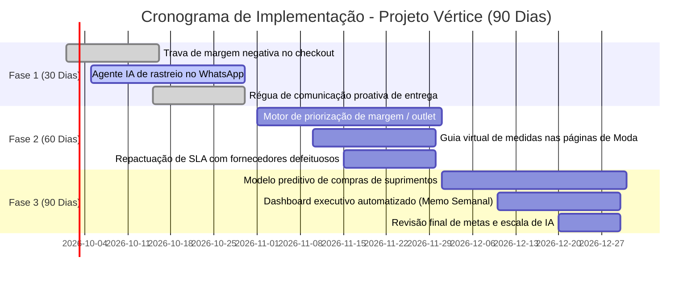

# Relatório Executivo de Diagnóstico Estratégico: Case Vértice Retail
## BootCamp Nova Geração — AI Consulting Lab | EloGroup (2026)

**Equipe / Grupo 18:** Ingrid Soares • Pedro Ribeiro ([@pedrorpr](https://github.com/pedrorpr))  
**Mentoria Técnica:** Coutinho, EloGroup  
**Data da Entrega:** 21 de Setembro de 2026  
**Data da Banca / Pitch Final:** 23 de Setembro de 2026  
**Entregável Oficial:** Diagnóstico Estratégico, Análises Quantitativas, Solução com IA e Business Case

---

### Sumário Executivo & Indicadores Estratégicos (KPIs)

| Indicador Estratégico | Valor Apurado (Dados Reais) | Benchmark / Alvo | Variação / Desvio | Impacto Econômico e Operacional |
| :--- | :---: | :---: | :---: | :--- |
| **Faturamento Bruto Anual** | **R$ 20.526.133,84** | R$ 20.000.000,00 | +2,6% | Escala comercial forte puxada por omnicanalidade |
| **Margem de Contribuição Média** | **54,37% (R$ 10,27M)** | > 50,0% | +4,37 p.p. | Margem bruta teórica saudável nos produtos |
| **Estoque Físico a Custo** | **R$ 348.701.550,87** | ~R$ 4.000.000,00 | **+8.617%** | **42,1 anos de cobertura** (1,67M peças vs 97k vendas) |
| **Giro Anual do Estoque** | **0,06x / ano** | 3,0x a 4,0x | **-98,0%** | Dias de cobertura mediano de 6.142 dias (~16,8 anos) |
| **Taxa de Devolução** | **14,87% (4.127 pedidos)** | < 6,0% | **+147,8%** | **R$ 1,52 milhão em margem sacrificada** |
| **Devoluções por Falhas Operacionais** | **69,6% das devoluções** | < 20,0% | **+248,0%** | Defeitos (25,2%), tamanhos (24,8%) e atrasos (19,6%) |
| **Custo de Customer Service** | **R$ 532.260,00 (35,8k tkts)** | R$ 200.000,00 | **+166,1%** | 135 minutos de espera média com CSAT 3,24/5,00 |
| **Tickets de Rastreio ("Onde está?")** | **30,0% (10.765 chamados)** | < 5,0% | **+500,0%** | R$ 159.660 gastos com atendentes humanos manuais |
| **Oportunidade Total de Captura** | — | — | — | **> R$ 78,0 MILHÕES** (R$ 69,7M caixa + R$ 8,3M margem/ano) |

---

## 1. Contexto do Negócio & O Paradoxo do Crescimento

A **Vértice Retail** é uma marca digital de moda, beleza e lifestyle voltada para jovens adultos. Ao longo do último ano fiscal, a empresa atingiu **R$ 20,53 milhões de faturamento bruto**, processando 27.759 transações por meio de um mix agressivo de mídias pagas (*Google Ads*, *Instagram Ads*, *TikTok Ads*), *Influenciadores*, *Marketplace* e canais próprios (*E-mail* e *Orgânico*).

No entanto, a Diretoria Executiva (CEO, CFO, CMO e COO) percebeu uma **severa contração de rentabilidade e uma asfixia na geração de caixa livre**. Os relatórios gerenciais da empresa eram manuais, os dados encontravam-se fragmentados entre departamentos e as decisões críticas de compras e operação vinham sendo tomadas com base em feeling e intuição.

Este relatório responde diretamente à pergunta estratégica do case:
> *"Como podemos usar dados e IA para melhorar rentabilidade, eficiência operacional e qualidade da tomada de decisão nos próximos 90 dias?"*

---

## 2. Perfilamento & Auditoria de Dados (Data Quality)

A consultoria conduziu uma auditoria forense nas cinco bases disponibilizadas:
1. `vendas.csv`: 27.759 transações (Jan/2023 a Jan/2024). 100% de integridade referencial com estoque e clientes. Detectou-se que 491 pedidos tiveram margem de contribuição negativa devido a frete subsidiado associado a cupons agressivos (>20%).
2. `estoque.csv`: 5.000 SKUs ativos em snapshot físico. Custo médio unitário de R$ 207,63 e preço de venda sugerido médio de R$ 503,57.
3. `atendimento.csv`: 35.841 chamados de suporte (2023 a 2025). Custo operacional total de R$ 532.260.
4. `clientes.csv`: 15.000 clientes cadastrados. Identificou-se que o sistema de vendas agregou milhares de compras anônimas ("Guest Checkout") sob o mesmo identificador (`CLI-11830` e `CLI-01729`).
5. `marketing.csv`: 3.500 campanhas por canal com ROAS médio de 4,18x.

---

## 3. Achado 1: A Asfixia do Capital de Giro por Superestocagem Crítica

A investigação aprofundada eliminou hipóteses superficiais (como suposta queda súbita nas vendas) e revelou um **colapso no planejamento de suprimentos**:

* **Estoque Físico Total:** 1.671.577 peças físicas.
* **Volume Anualizado Vendido:** 89.926 peças.
* **Valor do Estoque a Custo:** **R$ 348.701.550,87**.
* **CMV Anual de Vendas:** **R$ 8.278.603,59**.
* **Cobertura:** **42,1 anos de vendas** em estoque no ritmo atual.

O excesso de estoque concentra-se drasticamente na categoria **Moda (864.572 peças — 51,7% do inventário total)**. Além disso, **82 SKUs encontram-se completamente paralisados**, com zero peças vendidas em 13 meses, imobilizando **R$ 6,68 milhões de caixa**. O custo financeiro de carregar esse estoque ocioso representa **R$ 38,3 milhões anuais** de liquidez consumida a taxas de juros correntes (CDI 11% a.a.).

---

## 4. Achado 2: A Erosão Invisível da Margem por Devoluções Operacionais

A Vértice perde anualmente **14,87% de tudo o que vende** no pós-venda. Foram 4.127 pedidos devolvidos, correspondendo a **R$ 2,82 milhões em vendas brutas canceladas** e uma destruição líquida de **R$ 1,52 milhão em margem de contribuição**.

Ao contrário do senso comum, as devoluções não decorrem de mero "arrependimento" do consumidor (apenas 14,2%). **69,6% das devoluções (2.872 pedidos) são evitáveis e decorrem de ineficiências operacionais e técnicas**:
* **Produto com Defeito (25,2% - 1.039 pedidos):** Falta de homologação rigorosa de fornecedores de confecção e cosméticos.
* **Tamanho Errado (24,8% - 1.025 pedidos):** Ausência de tabela de medidas interativa e provador virtual no e-commerce de moda.
* **Atraso na Entrega (19,6% - 808 pedidos):** Ineficiência e falta de SLA estrito das transportadoras contratadas.

---

## 5. Achado 3: A Ineficiência Analógica do Atendimento ao Cliente

O setor de Customer Service processou 35.841 chamados a um custo operacional de **R$ 532.260**, operando de maneira puramente reativa e manual:
* **30,0% do volume total (10.765 chamados)** limita-se a responder à pergunta *"Onde está meu pedido?"*.
* Esse processo manual consome **R$ 159.660 anuais** de salário/hora de operadores humanos, que levam em média **135 minutos** para localizar uma encomenda e repassar o status ao cliente.
* O CSAT médio da operação encontra-se estagnado em **3,24 / 5,00**, gerando atrito e risco de churn na base de clientes.

---

## 6. Proposta da Solução Integrada com Inteligência Artificial

Para atacar as causas-raiz nos próximos 90 dias, desenhou-se uma **Solução Dual de IA**:

### Módulo B: Classificador Inteligente & Agente Resolutivo de Atendimento (WhatsApp / Chatbot)
* **Função:** Agente de IA generativa (LLM com function calling) conectado à API de transportadoras e ao ERP.
* **Mecanismo:** Classifica a intenção do cliente, analisa sentimento e responde 80%+ das dúvidas de rastreamento em menos de 10 segundos, emitindo código de postagem reverso automaticamente para defeitos/trocas.
* **Impacto:** Redução de SLA de 135 min para 10 segundos; economia direta de **R$ 127.728/ano** em custos de suporte; elevação do CSAT de 3,24 para > 4,20.

### Módulo C: Motor de Priorização de Margem & Desmobilização de Estoque
* **Função:** Algoritmo analítico de inteligência de catálogo para ranquear SKUs em 4 quadrantes de Risco × Retorno.
* **Mecanismo:**
  1. *SKUs sem giro (>180 dias):* Liquidação cirúrgica via canal outlet/kits com trava de margem contábil (evitando queimar caixa).
  2. *SKUs campeões de margem:* Preservação de preço cheio e proibição de cupons predatórios.
  3. *Trava de checkout:* Bloqueio algorítmico de pedidos com margem de contribuição negativa (estancando os 491 pedidos deficitários).
* **Impacto:** Desmobilização de R$ 69,7 milhões de estoque parado em 90 dias e proteção de R$ 38,5k de prejuízo direto de frete.

---

## 7. Business Case & Retorno do Investimento (ROI)

| Alavanca de Geração de Valor | Impacto Financeiro Anualizado | Natureza do Benefício |
| :--- | :---: | :--- |
| **Desmobilização de 20% do Excesso de Estoque** | **R$ 69.740.310,00** | **Injeção Imediata de Caixa / Liquidez** |
| **Economia de Juros Financeiros de Estoque (CDI 11%)** | **R$ 7.671.434,00 / ano** | Redução de Despesas Financeiras Líquidas |
| **Recuperação de Margem em Devoluções (Meta 30%)** | **R$ 456.956,00 / ano** | Incremento Direto de Margem Bruta |
| **Automação de Rastreio com Agente IA (Meta 80%)** | **R$ 127.728,00 / ano** | Redução de Custo Fixo Operacional |
| **Eliminação de Pedidos com Margem Negativa** | **R$ 38.508,00 / ano** | Estancamento de Prejuízos Comerciais |
| **VALOR TOTAL ANUALIZADO** | **> R$ 78,0 MILHÕES** | **Payback do Projeto < 30 dias** |

---

## 8. Roadmap de Implementação — Plano 30-60-90 Dias

* **Dias 1 a 30 (Estancamento de Perdas):** Implantação da trava de checkout contra pedidos deficitários e piloto do Agente de IA para dúvidas de rastreamento no WhatsApp.
* **Dias 31 a 60 (Recuperação de Margem e Giro):** Operação do Motor de Priorização de Margem para desovar os 82 SKUs parados e implantação do provador inteligente na categoria Moda.
* **Dias 61 a 90 (Governança & Escala Analítica):** Conexão do modelo preditivo de compras ao ERP para impedir superestocagem futura e geração automática do memo semanal da diretoria.

---

## 9. Riscos, Governança & Mitigação

1. **Risco de Alucinação de IA no Atendimento:** Mitigado via arquitetura RAG (Retrieval-Augmented Generation) com guardrails rígidos: o agente apenas lê e repassa o status retornado pela API oficial da transportadora. Caso o pedido não seja localizado, faz transbordo imediato para operador humano N2.
2. **Risco de Canibalização de Margem na Liquidação:** O Motor de Margem possui trava rígida: nenhum SKU pode receber desconto que resulte em preço abaixo do custo unitário cadastrado em `estoque.csv`.
3. **Privacidade e LGPD:** Mascaramento de dados sensíveis (CPF, telefone e e-mail) antes do envio para modelos de linguagem.

---

## 10. Conclusão & Próximos Passos para o Pitch Final (23/09)

O diagnóstico do Grupo 18 demonstra que a Vértice Retail tem um modelo comercial validado e produtos desejados pelo mercado, mas sofre de ineficiências operacionais internas perfeitamente solucionáveis. 

A proposta apresentada combina **estancamento imediato de vazamento de margem em 30 dias** com **destravamento de R$ 69,7 milhões de liquidez em 90 dias**, colocando a companhia no caminho de um EBITDA robusto e sustentável.
