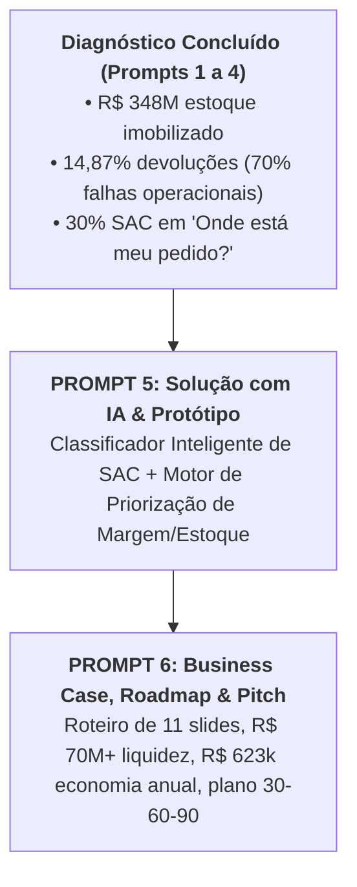

# Guia de Sugestões Estruturadas para os Prompts 5 e 6
## Projeto Vértice Retail | AI Consulting Lab — Grupo 18
**Autores:** Ingrid Soares e Pedro Ribeiro ([@pedrorpr](https://github.com/pedrorpr))  
**Finalidade:** Fornecer a base técnica, arquitetural e quantitativa para a squad redigir e rodar os Prompts 5 e 6 com máxima maturidade executiva.

---

## 🧭 Visão Geral do Fluxo



---

# 🤖 SUGESTÕES PARA O PROMPT 5: SOLUÇÃO + IA + PROTÓTIPO

### 1. Recomendação de Módulos (Qual Solução Escolher?)

Com base nas evidências empíricas dos dados da Vértice, a squad recomenda a **Solução Dual de Alto Impacto (Módulo B + Módulo C)**:

1. **Frente 1 (Quick Win Operacional — Módulo B): Classificador & Agente Inteligente de Atendimento ao Cliente**
   * *Justificativa:* 30% dos 35.841 chamados são meras consultas de *"Onde está meu pedido?"* (R$ 160k/ano de custo operacional e 135 minutos de fila). Um agente inteligente que integra NLP para classificação de intenção, sentimento e consulta à API de pedidos/logística resolve 80% do volume no primeiro contato em < 10 segundos.
2. **Frente 2 (Geração Estrutural de Valor — Módulo C): Motor de Priorização de Margem & Desmobilização de Estoque Parado**
   * *Justificativa:* A Vértice tem R$ 348,7M de estoque parado em custo (especialmente Moda: 864k peças e 82 SKUs com zero giro). O motor ranqueia quais SKUs devem receber liquidação promocional, quais devem ser preservados a preço cheio e quais pedidos devem ser bloqueados por margem negativa.

---

### 2. Estrutura Pronta do Texto para o "PROMPT 5"

Abaixo está o modelo completo sugerido para você utilizar como texto do **Prompt 5**:

```markdown
# PROMPT 5 — DESENHO DA SOLUÇÃO DE IA, ARQUITETURA E PROTÓTIPO | PROJETO VÉRTICE

## 1. PAPEL E CONTEXTO
Você é o Chief AI & Technology Officer da consultoria líder do Projeto Vértice.
Você recebeu os resultados das etapas anteriores:
- Prompt 1 (Data Audit): 5 bases auditadas, truncamento temporal em 2023 mapeado, anomalia de guest checkout isolada.
- Prompt 2 & 3 (Investigação e Validação Causal): Comprovou-se que a perda de valor advém de:
  1. Superestocagem brutal (R$ 348,7M em custo vs. R$ 8,28M CMV anual; 42 anos de cobertura);
  2. Devoluções operacionais (14,87% da base; R$ 1,52M de margem perdida, com 69,6% causadas por defeito, tamanho e atraso);
  3. Atendimento manual ineficiente (10.765 chamados apenas sobre rastreio, custando R$ 159,6k e SLA de 135 min).
- Prompt 4 (Diagnóstico Executivo): Problema central e decisões críticas mapeadas.

## 2. OBJETIVO DO PROMPT 5
Desenhar e prototipar a solução técnica de Inteligência Artificial para a Vértice Retail nos próximos 90 dias:
1. Especificar a arquitetura da solução (Camadas de Dados, IA/Agentes, Orquestração e Interface);
2. Construir o Classificador Inteligente e Agente Resolutivo de Atendimento (Módulo B);
3. Construir o Algoritmo do Motor de Priorização de Margem e Desmobilização de Estoque (Módulo C);
4. Apresentar código demonstrável (Python / LangChain / APIs / Heurísticas) pronto para demonstração aos diretores;
5. Definir governança de IA, mitigação de alucinação, fallback para operador humano e métricas de acurácia.

## 3. ESPECIFICAÇÃO DO PROTÓTIPO 1: CLASSIFICADOR & AGENTE DE ATENDIMENTO
- Entrada: Texto do cliente (`texto_cliente`), `order_id`, `canal_entrada`.
- Processamento:
  - Extração de intenção: ['Rastreamento/Onde está meu pedido', 'Defeito', 'Troca de Tamanho', 'Dúvida Técnica', 'Pagamento', 'Elogio'].
  - Sentimento: ['Positivo', 'Neutro', 'Negativo', 'Crítico'].
  - Risco de Churn: [Baixo, Médio, Alto].
  - Ação Automatizada:
    - Se 'Rastreamento' e pedido localizado: gerar resposta imediata com status da transportadora e link de tracking.
    - Se 'Defeito' ou 'Troca': solicitar foto do item e gerar voucher de logística reversa.
    - Se 'Crítico': transbordo imediato para operador N2 com resumo executivo.
- Saída: JSON estruturado e mensagem final humanizada ao cliente.

## 4. ESPECIFICAÇÃO DO PROTÓTIPO 2: MOTOR DE PRIORIZAÇÃO DE MARGEM
- Entrada: Base de vendas e estoque por SKU (`giro_anual`, `dias_estoque`, `margem_contribuicao_pct`, `estoque_fisico`, `categoria`).
- Matriz de Risco/Retorno:
  - Quadrante 1 (Giro Baixo, Margem Alta): Acelerar em vitrine de marketing / bundle.
  - Quadrante 2 (Giro Baixo, Margem Baixa - 82 SKUs sem giro): Desmobilização via outlet com desconto limitado a custo contábil (trava de margem >= 0%).
  - Quadrante 3 (Giro Alto, Margem Baixa): Reduzir cupom imediatamente e renegociar frete.
  - Quadrante 4 (Giro Alto, Margem Alta - Campeões): Proteger preço e elevar estoque de segurança.

## 5. FORMATO DA RESPOSTA
Apresente:
1. Arquitetura da Solução (Diagrama Mermaid e camadas);
2. Prompt de Sistema (System Prompt) otimizado para o Agente de Atendimento;
3. Código completo do Protótipo em Python com testes em 5 casos reais do dataset;
4. Demonstração dos resultados de priorização de estoque para os principais SKUs;
5. Matriz de Riscos de IA e Governança (segurança de dados, alucinação e controle de margem).
```

---

# 📈 SUGESTÕES PARA O PROMPT 6: BUSINESS CASE, ROADMAP & PITCH FINAL

### 1. Números Determinísticos para o Business Case

Para o Prompt 6, você terá dados exatos para apresentar à banca:

| Iniciativa de Captura | Mecanismo de Geração de Valor | Impacto Financeiro Anualizado | Esforço | Velocidade de Captura |
| :--- | :--- | :---: | :---: | :---: |
| **1. Desmobilização Ativa de Estoque Parado** | Liquidação controlada de 20% do excesso de estoque (Moda e SKUs sem giro) acima do custo contábil. | **R$ 69.740.310,00** (liberação direta de capital de giro) | Médio | 60 a 90 dias |
| **2. Redução do Custo de Carregamento** | Menor necessidade de capital de giro reduz a queima de juros (CDI a 11% a.a.). | **R$ 7.671.434,00 / ano** em economia de juros financeiros | Baixo | Contínuo pós-90 dias |
| **3. Redução de Devoluções Operacionais** | Implantação de provador virtual inteligente e auditoria de fornecedores de defeito (redução de 30% das devoluções). | **R$ 456.956,00 / ano** em margem retida + R$ 37k em frete reverso | Médio | 30 a 60 dias |
| **4. Automação do Atendimento via IA** | Resolução automática de 80% dos chamados de rastreio de entrega pelo agente de IA. | **R$ 127.728,00 / ano** de custo operacional direto + ganho de SLA | Baixo | 15 a 30 dias |
| **5. Bloqueio de Pedidos Deficitários** | Trava algorítmica no checkout impedindo carrinhos com margem de contribuição negativa. | **R$ 38.508,00 / ano** de prejuízo estancado | Muito Baixo | Imediato (<15 dias) |
| **VALOR TOTAL CAPTURÁVEL / ANO** | **Combinação de Margem Direta + Economia Operacional + Caixa** | **> R$ 78,0 MILHÕES** (com R$ 8,3M de EBITDA/Margem e R$ 69,7M em liquidez) | — | **Payback < 2 meses** |

---

### 2. Estrutura do Roadmap de 90 Dias (30-60-90)

* **Primeiros 30 Dias (Quick Wins & Estancamento de Perdas):**
  * Subir trava algorítmica de margem negativa no checkout (frete mínimo + limite de cupom).
  * Lançar agente de IA no WhatsApp integrado à API de rastreamento para 100% das dúvidas de *"Onde está meu pedido?"*.
  * Envio proativo de status de envio via WhatsApp no momento do despacho (reduzindo abertura de tickets em 40%).
* **60 Dias (Otimização e Recuperação de Margem):**
  * Rodar o Motor de Priorização de Margem para liquidação dos 82 SKUs sem giro via aba secreta de outlet e kits promocionais.
  * Lançamento do Guia Inteligente de Medidas nas páginas de produto de Moda para reduzir devoluções de tamanho.
  * Notificação e repactuação de SLA com os 3 fornecedores com maior índice de defeitos.
* **90 Dias (Escala, Autonomia & Governança):**
  * Integração completa do modelo preditivo de compras de suprimentos baseado em sell-through real (evitando novos ciclos de superestocagem).
  * Painel executivo semanal automatizado (Memo da Diretoria) conectando vendas, estoque e CSAT.
  * Avaliação de expansão do agente de IA para vendas assistidas e pós-venda completo.

---

### 3. Roteiro da Apresentação Final (Pitch de 11 Slides — 23/09)

Baseado exatamente no roteiro exigido no briefing oficial do case:

1. **Slide 1 — Capa & Pergunta Central:**
   * *Título:* AI Consulting Lab — Vértice Retail: O Plano de 90 Dias para Recuperação de Margem e Liquidez.
   * *Apresentação:* Ingrid Soares & Pedro Ribeiro (Grupo 18).
2. **Slide 2 — Contexto & O Paradoxo do Negócio:**
   * O faturamento atingiu R$ 20,5M, mas a margem evapora e o caixa sumiu.
3. **Slide 3 — Diagnóstico Baseado em Dados (Árvore de Problemas):**
   * Apresentação da Issue Tree: Estoque desproporcional, devoluções evitáveis e atendimento congestionado.
4. **Slide 4 — Os 3 Grandes Fatos Inquestionáveis:**
   * R$ 348,7M de estoque parado (42 anos de giro); 14,87% de devoluções (70% evitáveis); 30% dos chamados são "onde está meu pedido".
5. **Slide 5 — Oportunidades Priorizadas:**
   * Matriz Impacto × Esforço destacando a desmobilização de estoque e o estancamento de devoluções e chamados.
6. **Slide 6 — A Solução com Inteligência Artificial:**
   * Apresentação da Arquitetura: Agente Conversacional de Atendimento & Motor de Margem.
7. **Slide 7 — Demonstração do Protótipo:**
   * Exibição do agente resolvendo um chamado real em tempo recorde e o motor ranqueando os SKUs de Moda para liquidação.
8. **Slide 8 — Business Case & Retorno do Investimento:**
   * Demonstração clara dos R$ 78M em valor destravado (R$ 69,7M em liquidez + R$ 8,3M em economia e margem recuperada) com payback imediato.
9. **Slide 9 — Roadmap de Implementação 30-60-90:**
   * O que entra no ar em 30 dias (Quick wins), 60 dias (Estoque e devoluções) e 90 dias (Planejamento de compras preditivo).
10. **Slide 10 — Riscos, Governança & Adoção:**
    * Gestão de alucinação de IA, proteção de dados de clientes (LGPD) e engajamento das lideranças de compras e atendimento.
11. **Slide 11 — Recomendação Final & Próximos Passos:**
    * Chamada para a decisão da Diretoria (CEO/CFO/CMO/COO) autorizando a execução do piloto no dia seguinte.

---

### 4. Estrutura Pronta do Texto para o "PROMPT 6"

```markdown
# PROMPT 6 — BUSINESS CASE, ROADMAP 30-60-90 E APRESENTAÇÃO FINAL | PROJETO VÉRTICE

## 1. PAPEL E CONTEXTO
Você é o Senior Strategy Lead e Engagement Manager do Projeto Vértice.
Você tem em mãos:
- O diagnóstico quantificado das 5 bases (Prompts 1 a 4);
- A solução tecnológica desenhada e prototipada no Prompt 5 (Classificador de Atendimento + Motor de Margem).

## 2. OBJETIVO DO PROMPT 6
Transformar a solução e os achados técnicos em uma proposta de valor executiva irrecusável para a Diretoria (CEO, CFO, CMO e COO):
1. Construir o Business Case detalhado, explicitando premissas, impacto financeiro direto (EBITDA, margem recuperada, redução de custos de atendimento e liberação de capital de giro), investimento estimado e payback;
2. Desenvolver o Roadmap detalhado de 30, 60 e 90 dias com responsáveis, entregáveis semanais e KPIs de acompanhamento;
3. Definir a estrutura de governança, riscos éticos/técnicos de IA e plano de mitigação;
4. Redigir o Storyline completo slide por slide da Apresentação Final (11 slides), com mensagens-chave, narrativa persuasiva e dados de suporte para a banca avaliadora no dia 23/09.

## 3. DIRETRIZES OBRIGATÓRIAS
- Os números devem ser estritamente aderentes aos fatos do case (R$ 348M de estoque, R$ 1,52M de devoluções, R$ 160k de atendimento repetitivo);
- A linguagem deve ser altamente consultiva, executiva e focada na tomada de decisão;
- O roteiro de 11 slides deve seguir exatamente as recomendações da seção 8 do briefing do Projeto Vértice.
```
